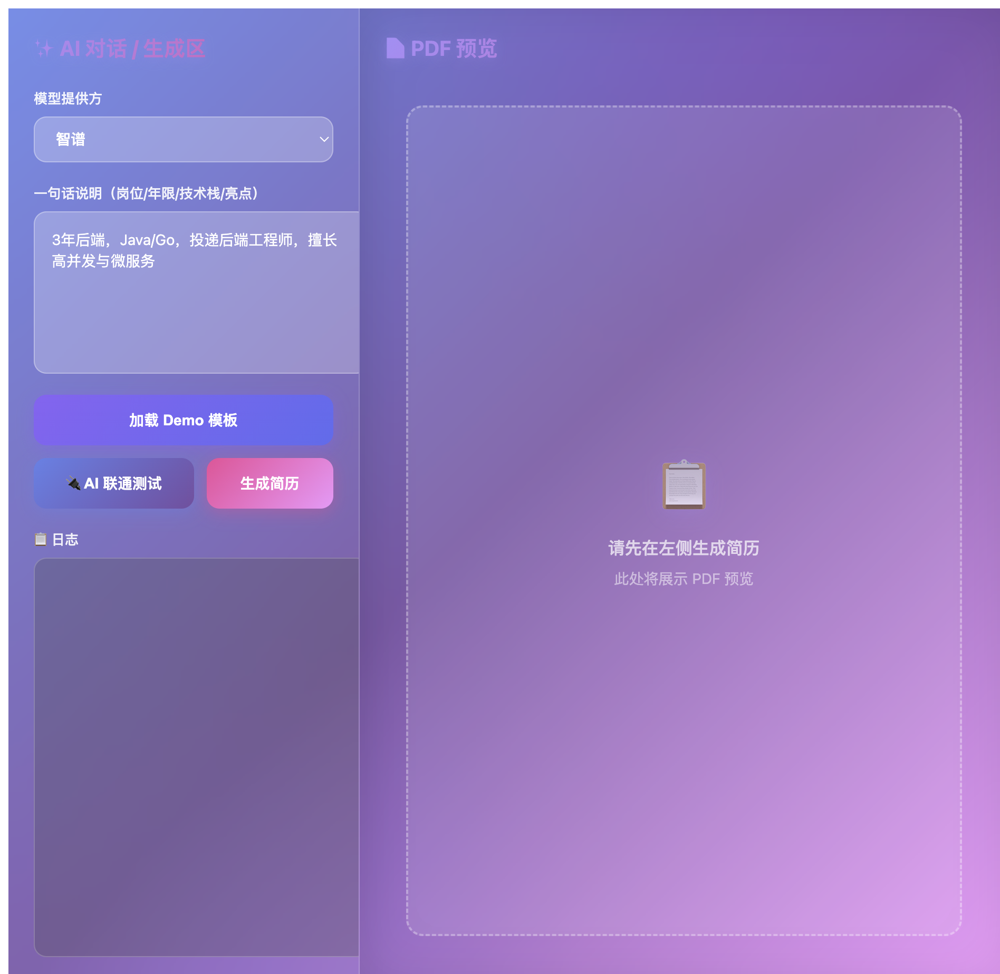
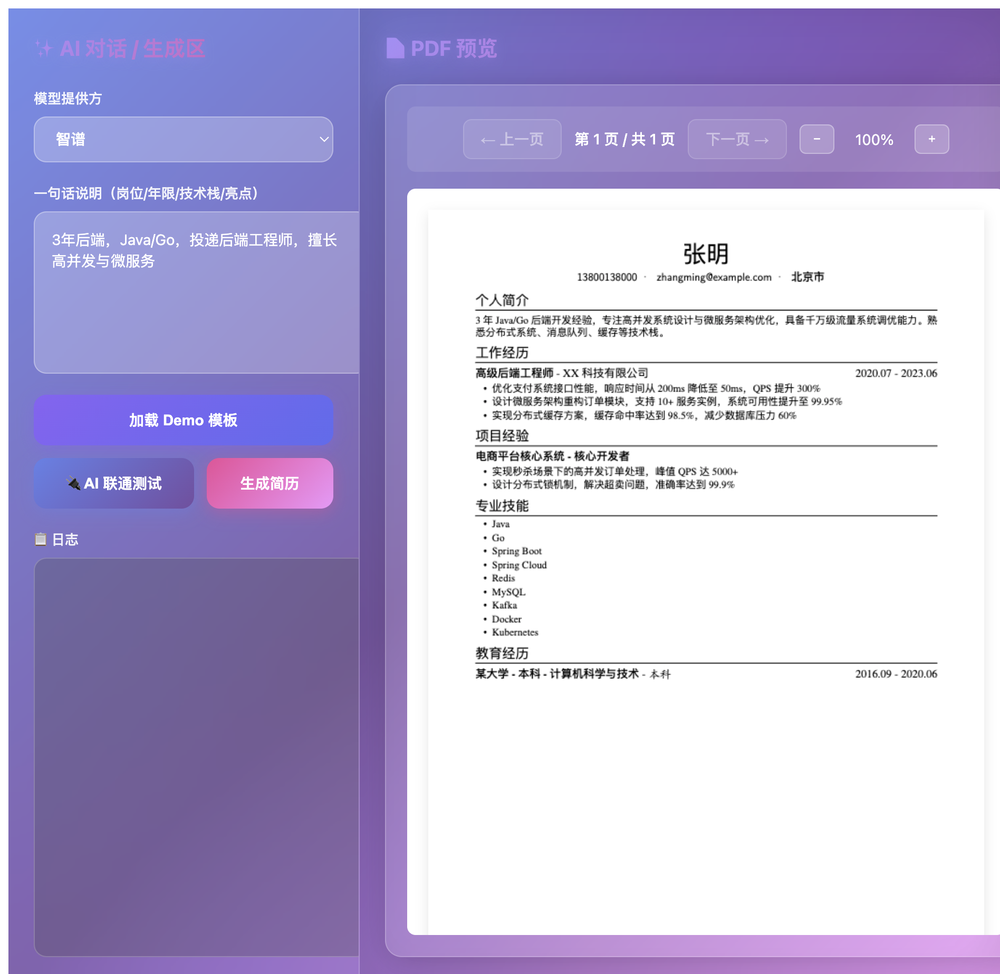

# Resume-Agent-简历生成系统

## 核心功能流程

本系统实现了从一句话描述到专业 PDF 简历的完整自动化流程。

### 工作流程

```
用户输入一句话 → AI 生成简历 JSON → LaTeX 代码生成 → PDF 编译 → 用户预览
```

### 详细步骤

#### 1. 用户输入（初始界面）

用户在左侧面板输入一句话描述，包含：
- 岗位/职位
- 工作年限
- 技术栈
- 个人亮点



#### 2. AI 生成简历 JSON

系统调用 AI 模型（智谱/Gemini），将用户的自然语言描述转换为结构化的简历 JSON 数据，包含：
- 姓名、联系方式
- 个人简介
- 工作经历
- 项目经验
- 技能列表
- 教育背景

#### 3. LaTeX 代码生成

系统将 JSON 数据转换为专业的 LaTeX 代码：
- 使用 `resume.cls` 模板类
- 自动转义特殊字符
- 动态生成各个章节
- 支持中英文字体（PingFang SC / TeXGyreTermes）

#### 4. PDF 编译

使用 XeLaTeX 编译 LaTeX 代码：
- 嵌入字体（确保跨平台显示一致）
- 支持 Unicode 编码（`uni=yes`）
- 生成高质量的 PDF 文件

#### 5. 用户预览

PDF 在右侧面板实时预览：
- 支持翻页和缩放
- 字体完整渲染
- 专业排版效果



### 技术特点

- **AI 驱动**：使用大语言模型理解用户意图、自动生成结构化内容
- **LaTeX 排版**：专业级 PDF 生成、确保排版质量
- **字体支持**：完整支持中文字体渲染、解决 PDF.js 字体显示问题
- **实时预览**：前端即时显示生成的 PDF

### 快速开始

1. 在左侧输入框输入简历描述
2. 点击"生成简历"按钮
3. 等待 AI 生成和 PDF 编译
4. 在右侧查看生成的简历 PDF

或者直接点击"加载 Demo 模板"快速查看示例效果。


### 技术栈

- **前端**：React + TypeScript + Vite
- **后端**：FastAPI + Python
- **AI 模型**：智谱 GLM-4.5V / Google Gemini
- **PDF 生成**：XeLaTeX + PDF.js
- **字体**：PingFang SC（中文）+ TeXGyreTermes（英文）
