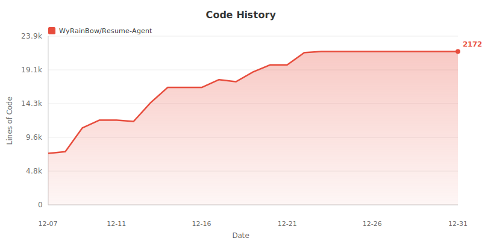
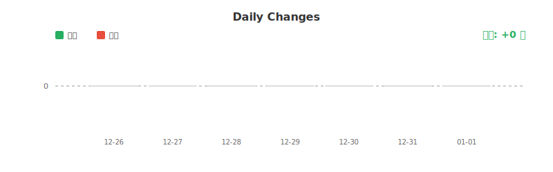
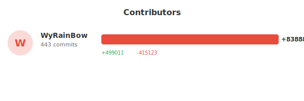
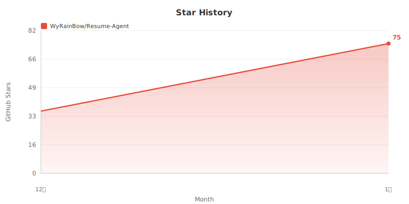
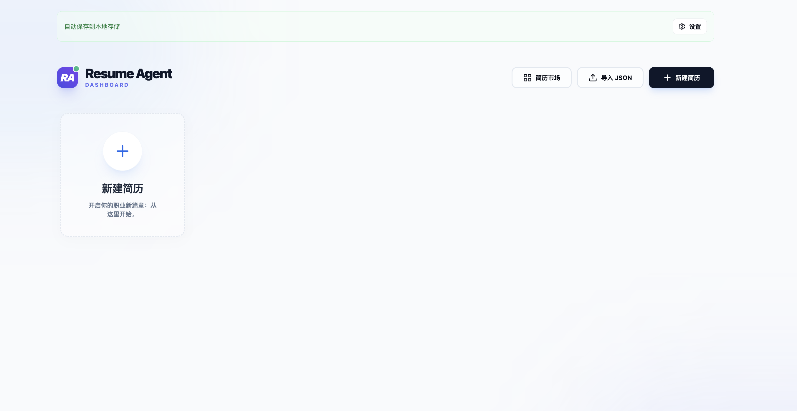
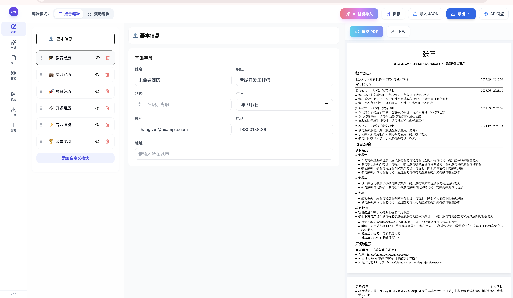

# Resume-Agent - AI 简历生成系统

> 一句话描述、AI 自动生成专业 PDF 简历

[](LICENSE)

## 项目代码统计


<!-- 代码行数趋势图 - 每日自动更新 -->


<!-- 每日代码变化图 -->


## 贡献者统计



## Star 趋势



<!-- 备用链接：按日期显示的 Star 趋势 -->
<!-- [](https://star-history.com/#WyRainBow/Resume-Agent&Date) -->

## ✨ 核心功能

## 前端页面

### 首页


### Dashboard 简历管理


### 工作区


### AI 对话生成简历


###  AI 智能生成
- 支持一句话描述快速生成完整简历
- 支持粘贴完整简历文本、智能解析为结构化数据

###  可视化编辑
- 左侧编辑器、右侧实时预览、所见即所得
- 支持拖拽排序模块顺序
- 每个模块支持独立 AI 导入和 AI 改写功能
- 富文本编辑、支持加粗、斜体、列表等格式

### PDF 导出
- 专业 LaTeX 排版、生成高质量 PDF
- 支持中英文字体完美渲染
- 实时预览、支持翻页和缩放

### AI 辅助功能
- **AI 导入**：将文本智能解析为对应模块数据
- **AI 改写**：根据指令优化现有内容、如量化数据、突出成果

##  快速开始


### 环境要求
- Python 3.8+
- Node.js 16+
- XeLaTeX、用于 PDF 编译
- 中文字体、macOS 自带、Linux 需安装 Noto CJK

### 安装步骤

**1、克隆仓库**
```bash
git clone https://github.com/WyRainBow/Resume-Agent.git
cd Resume-Agent
```

**2、配置环境变量**
创建 `.env` 文件，填入 DeepSeek API Key：
```bash
cp .env.example .env
# 编辑 .env 文件，填入 DEEPSEEK_API_KEY=your_api_key_here
```

**3、安装依赖**
```bash
pip install -r backend/requirements.txt
cd frontend && npm install
```

**4、启动服务**
```bash
# 后端（从项目根目录）
export PYTHONPATH="$(pwd):$PYTHONPATH"
python3 -m uvicorn backend.main:app --host 0.0.0.0 --port 9000 --reload

# 前端
cd frontend && npm run dev
```

**5、访问应用**
- 前端、http://localhost:5173
- 后端 API、http://localhost:9000
- API 文档、http://localhost:9000/docs

**详细配置说明请查看 [LOCAL_SETUP.md](LOCAL_SETUP.md)**

## 🛠️ 技术栈

### 前端
- React 18 + TypeScript + Vite
- PDF.js 渲染
- 紫色渐变主题、玻璃态设计

### 后端
- FastAPI + Python
- 多 AI 模型支持、智谱、Gemini、豆包
- XeLaTeX PDF 生成
- Reflection Agent 自动优化

### AI 模型配置
| 功能 | 模型 | 说明 |
|------|------|------|
| 简历生成 | Gemini 2.5 Pro | 文本到 JSON |
| AI 改写 | 智谱/Gemini/豆包 | 内容优化 |
| 视觉分析 | GLM-4V-Flash | 截图分析排版 |

## 📝 许可证

MIT License

## 🤝 贡献

欢迎提交 Issue 和 Pull Request

## 📮 联系方式

- GitHub、[@WyRainBow](https://github.com/WyRainBow)
- 仓库地址、https://github.com/WyRainBow/Resume-Agent

---