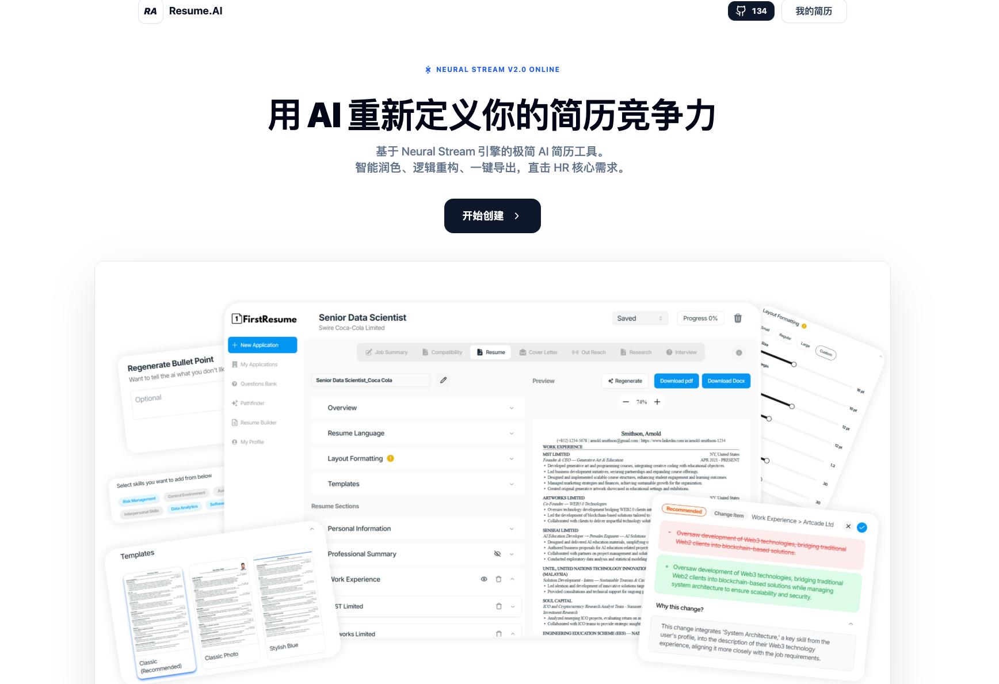
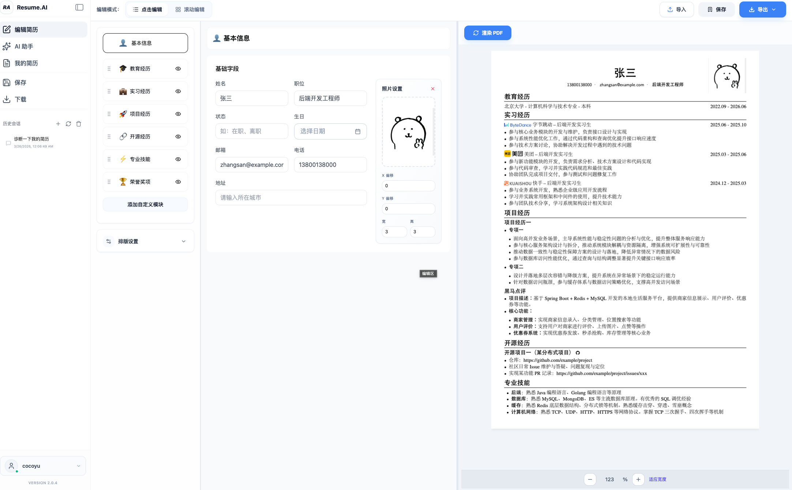
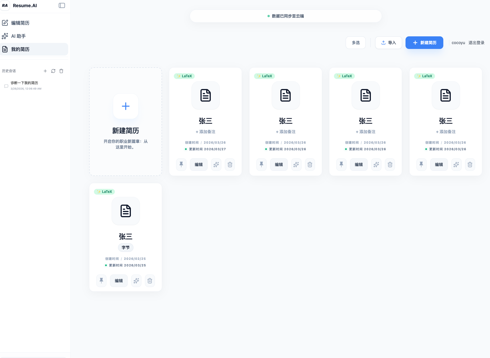
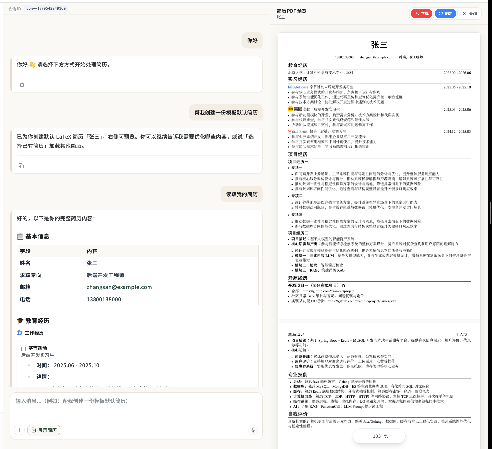

<div align="center">

# 🤖 Resume-Agent

### 一句话输入，AI 帮你生成可编辑、可导出的专业简历

<p>
  <a href="https://resumegenkk.xyz"></a>
  <a href="https://github.com/WyRainBow/Resume-Agent/stargazers"></a>
  <a href="LICENSE"></a>
</p>

<p>
  
  
  
  
  
</p>



</div>

---

## 📖 项目介绍

**Resume-Agent** 是一个面向中文求职场景的 AI 简历系统，覆盖从 **内容生成 → 结构化编辑 → 高质量 PDF 导出** 的完整流程。你只需要一句话描述，剩下的排版、润色、导出都交给 AI。

> 🎯 适合：想快速产出一份专业简历、又不想折腾排版的求职者与开发者。

## ✨ 核心能力

| 能力 | 说明 |
|:--|:--|
| 🚀 **AI 一键生成** | 根据一句话描述或原始文本，快速生成结构化简历 |
| 💬 **对话式修改** | 自然语言对话增量编辑，支持润色、翻译、扩写、缩写 |
| 📤 **智能上传解析** | 上传 PDF / 图片简历，AI 自动解析为结构化数据并导入 |
| 🔍 **AI 简历诊断** | 围绕 JD 匹配、内容完整性、表达质量，输出可解释评分与改进建议 |
| ✍️ **划词润色** | 选中任意文本，一键润色 / 翻译 / 扩写 / 缩写 |
| 👀 **可视化编辑** | 左编辑右预览，支持点击编辑与滚动编辑两种模式 |
| 🎨 **多模板系统** | 内置多套 LaTeX / HTML 模板，一键切换与快速创建 |
| 📄 **高质量导出** | 基于 LaTeX 生成专业 PDF，中英文渲染 + 浏览器端导出 |

## 📸 页面截图

<table>
<tr>
<td width="50%"><b>Dashboard 简历管理</b><br/></td>
<td width="50%"><b>工作区</b><br/></td>
</tr>
<tr>
<td width="50%"><b>AI 对话</b><br/></td>
<td width="50%" valign="middle" align="center">👉 <a href="https://resumegenkk.xyz">在线体验完整功能</a></td>
</tr>
</table>

## 🛠️ 技术架构

**前端** &nbsp;·&nbsp; React 18 · TypeScript · Vite
**后端** &nbsp;·&nbsp; FastAPI · Python · LaTeX PDF 渲染

## 🚀 快速开始

### 环境要求

- Python 3.12+
- Node.js 16+
- XeLaTeX
- 中文字体（Linux 建议安装 Noto CJK）

### 安装与启动

```bash
# 1. 克隆项目
git clone https://github.com/WyRainBow/Resume-Agent.git
cd Resume-Agent

# 2. 安装依赖
uv pip install -r requirements.txt
cd frontend && npm install && cd ..

# 3. 启动后端
python -m uvicorn backend.main:app --host 127.0.0.1 --port 9000

# 4. 启动前端（另开终端）
cd frontend && npm run dev
```

### 访问地址

| 服务 | 地址 |
|:--|:--|
| 前端 | http://localhost:5173 |
| 后端 API | http://127.0.0.1:9000 |
| OpenAPI 文档 | http://127.0.0.1:9000/docs |

### 开发验证

```bash
cd frontend && npm run build
```

> 后端建议先跑目标模块测试，再按需执行 `pytest`。

## 🤝 贡献

欢迎通过 [Issue](https://github.com/WyRainBow/Resume-Agent/issues) 和 [Pull Request](https://github.com/WyRainBow/Resume-Agent/pulls) 参与改进。如果这个项目对你有帮助，欢迎点个 ⭐ Star 支持一下！

## 📄 许可证

本项目基于 [MIT License](LICENSE) 开源。
