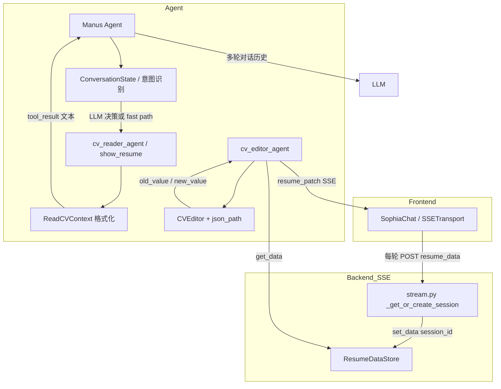
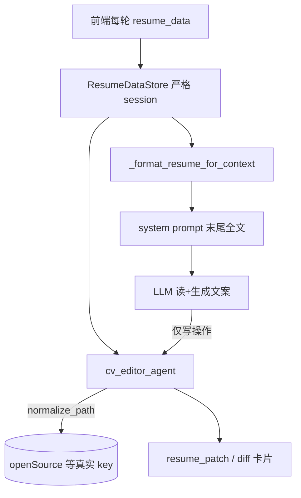
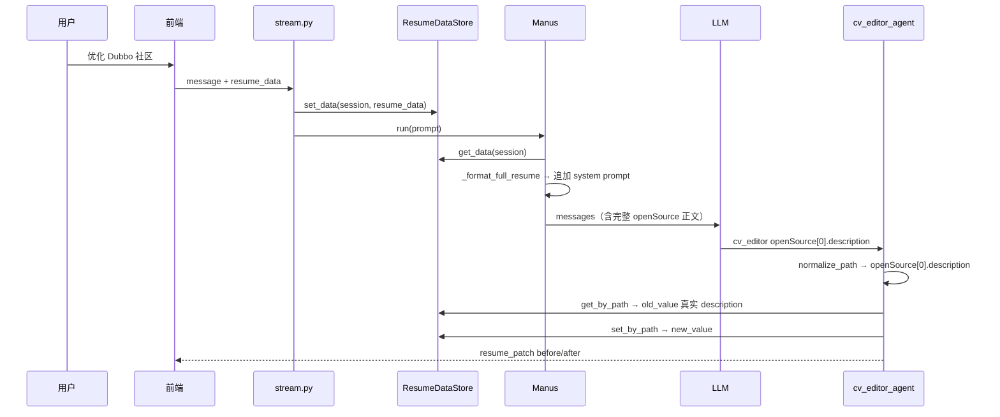

# Resume-Agent 简历读取架构重构：从 Tool-Only 到 Hybrid

> 文档日期：2026-05-21  
> 分支：`feature/05-21`  
> 相关提交：`fde2ac1` → `7375d14` → `f766b6f`

---

## 1. 背景与目标

Resume-Agent 的对话能力依赖「先读懂用户简历，再优化/修改」。早期实现把「读取简历」包装成 Agent Tool（`cv_reader_agent` / `show_resume`），由 LLM 在 ReAct 循环中决定是否调用。

用户在测试中反复遇到三类现象：

1. **读取内容过于简略**：问「读取我的开源经历」只返回项目标题，没有 `description` 细节。
2. **读取与 diff「修改前」对不上**：对话里展示的 Dubbo 内容与 diff 卡片里的「修改前」完全不同，甚至出现「原先无内容」。
3. **新建会话仍像读到旧数据**：切换会话后，行为不符合「新会话应干净」的预期。

本文档记录：**原有架构是什么、如何定位根因、最终如何改成 Hybrid，以及配套修复了哪些底层问题。**

---

## 2. 改造前的架构（Tool-Only Read）

### 2.1 端到端数据流



### 2.2 关键组件职责

| 组件 | 路径 | 职责 |
|------|------|------|
| 前端 SSE | `frontend/src/transports/SSETransport.ts` | 每轮请求携带 `resume_data` |
| 会话入口 | `backend/agent/web/routes/stream.py` | 创建/复用 session，`ResumeDataStore.set_data()` |
| 数据中枢 | `backend/agent/tool/resume_data_store.py` | 按 `conversation_id` 存简历 JSON |
| 读取 Tool | `backend/agent/tool/cv_reader_agent_tool.py` | 从 Store 取数 → `ReadCVContext` → 返回格式化文本 |
| 展示 Tool | `backend/agent/tool/show_resume_tool.py` | 与 reader 几乎相同，额外服务 UI 事件 |
| 格式化 | `backend/agent/tool/cv_reader_tool.py` | `strip_html` + section 格式化 |
| 编辑 Tool | `backend/agent/tool/cv_editor_agent_tool.py` | 从 Store 取 JSON，`CVEditor.edit_resume()` |
| 路径编辑 | `backend/agent/agent/cv_editor.py` + `json_path.py` | `get_by_path` / `set_by_path` 读写叶子字段 |
| Prompt | `backend/agent/prompt/manus.py` | 规定「优化必须先 cv_reader 再 cv_editor」 |

### 2.3 当时 system prompt 里有什么

`Manus._generate_dynamic_prompts()` **只注入状态文案**，不注入简历正文：

```text
✅ 简历已加载
```

或：

```text
⚠️ 简历未加载，建议先加载简历
```

完整简历 JSON **不在** LLM 的 system context 里。模型要「看到」简历，必须：

- 调用 `cv_reader_agent` / `show_resume`，或
- 依赖历史消息里某次 tool_result 的文本（易丢失、易截断、易过期）。

### 2.4 「读」与「写」实际用的不是同一条链路

这是后续大量 bug 的理论根源：

| 动作 | 数据来源 | 消费方 |
|------|----------|--------|
| 用户问「读取简历」 | `ResumeDataStore` → `ReadCVContext` 文本 | LLM 对话回复 |
| 用户问「优化 Dubbo」 | Prompt 要求先 reader，再 editor | LLM 中间记忆 + tool |
| diff「修改前」 | `ResumeDataStore` → `CVEditor._update()` → `get_by_path(path)` | 前端 `ResumeDiffCard` |

也就是说：

- **展示给用户的「读」** = 格式化后的 **字符串**（且依赖 LLM 是否完整复述）。
- **diff 的「改前」** = JSON 上 **精确 path** 的原始字段值。

两条链路只有「理想情况下」一致，没有任何机制保证同轮、同 path、同字段。

---

## 3. 问题发现过程（按时间线）

### 3.1 现象 A：读取只有标题，优化却冒出长文

**用户操作：**

1. 「读取我的开源经历」→ 只列出 `Dubbo-Go 社区`、`Resume-Agent` 两个名字。
2. 「优化一下我的开源经历」→ 突然给出带「性能提升 20%」等细节的完整 bullets。

**初步判断：** 不是模型「凭空编造」，而是 **第一次读时 formatter 丢了字段**，第二次优化时模型在未读全的情况下补全内容。

**代码验证：** `_format_section()` 里的 `_format_opensource` 曾仅为：

```python
return "\n".join(f"- **{os.get('name')}**" for os in opensource)
```

而 `_format_full_resume()` 同一段落会输出 `description`、`role`、`repo` 等。  
→ **同一份 Store 数据，「全量读」和「按 section 读」行为不一致。**

**修复提交：** `fde2ac1` — 补全各 section formatter，并强化 `manus.py` 中「必须完整展示 reader 结果」的规则。

---

### 3.2 现象 B：读取内容与 diff「修改前」不一致

**用户操作（Hybrid 改造前/后均可能出现）：**

1. 读取 Dubbo：展示「阿里开源分布式事务框架…」等 **Store 里真实 description**。
2. 优化 Dubbo：diff 左侧「修改前」却是另一段话（如「贡献了核心模块的代码优化…」），或 **「原先无内容」**。

**排查结论：这不是单一 bug，而是多层叠加。**

#### 层 1：LLM 未稳定持有正文（架构层）

- 读：靠 tool_result 或模型摘要。
- 改前：靠 `get_by_path("openSource[0].description")`（注意驼峰）。
- 模型优化时依据的「心中原文」可能与 Store 不一致。

#### 层 2：path 大小写错误（实现层）— **「原先无内容」的直接原因**

JSON 权威字段（见 `ResumeData` / 前端类型）为 **`openSource`**（驼峰）。

Prompt 与 reader 注释长期写的是 **`opensource[N].description`**（全小写）。

`json_path.get_by_path()` 对 key **大小写敏感**：

```python
if p not in cur:
    raise ValueError(f"字典键不存在: '{p}'")
```

`CVEditor._update()` 逻辑：

```python
if exists_path(self._resume_data, parts):
    _, _, old_value = get_by_path(self._resume_data, parts)
set_by_path(self._resume_data, path, value)  # path 不存在时会自动创建中间节点
```

当 LLM 传入 `opensource[0].description` 时：

1. `exists_path` → False → `old_value = None` → 前端显示「原先无内容」。
2. `set_by_path` 在根对象上 **新建** `opensource` 数组/字段，**不会修改** 原有 `openSource[0].description`。
3. 用户以为改的是 Dubbo，实际简历 JSON 里多了一套错误 key。

**修复提交：** `f766b6f`

- `cv_editor.py` 增加 `PATH_ALIASES` + `normalize_path()`，`opensource` → `openSource` 等。
- `manus.py` / `cv_reader_tool.py` 的 path 提示改为 `openSource[N].description`。

#### 层 3：ResumeDataStore 会话泄漏（会话层）

改造前 `set_data()`：

```python
cls._data = resume_data  # 每次带 session_id 也会写全局
```

`get_data(session_id)` 在 session 未命中时 **fallback**：

```python
return cls._data  # 可能拿到上一个会话的数据
```

且 `clear_session` / TTL cleanup **未** 调用 `ResumeDataStore.clear_data()`。

→ 新会话、未带 `resume_data` 的请求可能读到旧会话简历；与「读」「改」叠加后表现为完全对不上的内容。

**修复提交：** `f766b6f` — session 严格隔离 + 清理钩子。

---

### 3.3 现象 C：新建会话后仍提示「请选择简历」

截图显示：右侧 PDF 已有简历，左侧仍让「创建/选择简历」。

可能原因组合：

1. 当轮 SSE **未带** `resume_data`，Store 为空，Hybrid 注入为空，模型走 `show_resume` 流程。
2. 上一会话全局 `_data` 污染（修复前），或本 session 未 `update_resume_loaded(True)`。
3. 用户连发两次「读取我的简历内容」，fast path / 意图识别与 UI 选简历状态不同步。

会话隔离修复后，**至少排除「读到别人会话数据」**；仍需保证前端在新会话首条消息携带当前编辑器 `resume_data`。

---

## 4. 方案调研：为什么不继续纯 Tool Read？

### 4.1 市面常见四类做法

| 方案 | 典型场景 | 优点 | 缺点 |
|------|----------|------|------|
| Context Injection | ChatGPT 附件、Copilot | 0 额外 tool 轮次 | 每轮 token；编辑后需刷新 context |
| Tool Read | 通用 Agent、要 tool UI | 可观测、可按 section | +1 轮延迟；可能不调 tool |
| **Hybrid** | 简历/JD 编辑器 | 读准 + 写结构化 | 实现稍复杂 |
| RAG | 超长文档 | 省 token | 单份简历通常过重 |

### 4.2 对 Resume-Agent 的结论

产品特征：

- 单份结构化 JSON，strip HTML 后约 **2K–8K tokens**；
- 必须 **写回** 数据库 + **diff 卡片**（`resume_patch` SSE）；
- 需要 **path 级** 修改（`openSource[0].description`）。

因此采用原则：

> **读进 context（免费、每轮一致）；写走 tool（必须）；展示/加载/结构探测保留专用 tool。**

不是删除 `cv_reader_agent`，而是 **收窄职责**，避免与「全文注入」重复劳动。

---

## 5. Hybrid 方案设计

### 5.1 目标架构



### 5.2 职责重新划分

| 能力 | 改造后做法 |
|------|------------|
| 用户问「读取/我的 Dubbo 是什么」 | 直接根据 system 里已注入的全文回答，**不强制**调 reader |
| 用户问「优化某段」 | 基于 context 原文生成 value，**直接** `cv_editor_agent` |
| 从 markdown 文件加载 | 仍用 `cv_reader_agent` + `file_path` |
| 查看 JSON 字段结构 | `cv_reader_agent` + `output_mode=structure` |
| UI 展示简历卡片 | `show_resume` tool 事件（保留） |
| 持久化修改 | `cv_editor_agent` → `ResumeDataStore.persist_data` |

### 5.3 Prompt 规则变化（`backend/agent/prompt/manus.py`）

**删除：**

- 「优化必须先调用 cv_reader_agent」两步流程；
- 「即使用户刚展示过简历，本轮仍需重新读取」。

**新增：**

- 「简历上下文（Hybrid 模式）」章节；
- 明确 cv_reader **仅** 用于文件加载与 structure 模式；
- 优化规则改为：**直接基于 context 当前内容** 调用 `cv_editor_agent`。

### 5.4 注入实现（`backend/agent/agent/manus.py`）

每轮 `_generate_dynamic_prompts()` 末尾：

```python
resume_text = self._format_resume_for_context()
if resume_text:
    system_prompt = f"{system_prompt}\n\n{resume_text}"
```

`_format_resume_for_context()`：

1. `ResumeDataStore.get_data(self.session_id)` — 与 editor **同一 Store、同一 session**；
2. `ReadCVContext()._format_full_resume()` — 与 reader tool **同一格式化逻辑**（含 `[N]` 索引与 `path prefix: openSource[N].*` 提示）。

从而保证：

- LLM 看到的 Dubbo 正文 = Store 里 `openSource[0].description` 的 HTML 去标签版本；
- editor 取的 `old_value` = 同一 JSON 节点（path 经 `normalize_path` 校正后）。

---

## 6. 实现清单与提交对照

| 提交 | 说明 | 主要文件 |
|------|------|----------|
| `fde2ac1` | 补全 section formatter；reader 规则 | `cv_reader_tool.py`, `manus.py` (prompt) |
| `7375d14` | **Hybrid**：system 注入全文 | `manus.py` (agent + prompt) |
| `f766b6f` | session 隔离 + path 别名 + clear_session 清理 | `resume_data_store.py`, `stream.py`, `cv_editor.py`, prompt/reader path 文案 |

### 6.1 `cv_reader_tool.py`（formatter）

- `_format_opensource` / `_format_projects` / `_format_awards` / `_format_education` 输出完整字段；
- `_format_full_resume` 统一 `### [i]` 索引与 path 提示；
- Open Source 段 path 提示改为 `openSource[N].*`。

### 6.2 `resume_data_store.py`（会话隔离）

```python
# set_data：有 session_id 则只写 _data_by_session，不写全局 _data
# get_data：有 session_id 但未命中 → return None（不 fallback 全局）
# clear_data：pop session 时同时清理 shared_state
```

### 6.3 `stream.py`（生命周期）

- `_cleanup_session()`：驱逐 stale session 时 `ResumeDataStore.clear_data(cid)`；
- `DELETE /stream/session/{id}`：`clear_session` 同样 `clear_data(conversation_id)`。

### 6.4 `cv_editor.py`（path 归一化）

```python
PATH_ALIASES = {
    "opensource": "openSource",
    "open_source": "openSource",
    "skillcontent": "skillContent",
    ...
}

async def edit_resume(self, path, action, value=None):
    path = normalize_path(path)
    ...
```

在 `edit_resume` 入口统一归一化，避免 LLM 输出小写 path 导致「改前为空 + 写错 key」。

---

## 7. 改造后的单次对话时序（优化 Dubbo 为例）



用户在前端看到的「修改前」应与上一轮「读取简历」中 Dubbo 段落 **同源**。

---

## 8. 仍保留 Tool 的理由（避免误删）

以下需求 **无法** 用纯 context injection 替代：

1. **`resume_patch` / diff 卡片**：依赖 `cv_editor_agent` 结构化输出与 `patch_id`。
2. **数据库持久化**：`ResumeDataStore.persist_data` 在 editor 成功路径触发。
3. **文件导入**：`cv_reader_agent(file_path=...)` + `parse_markdown_resume`。
4. **字段结构探测**：`output_mode=structure` 给模型/editing 定位 path。
5. **前端 tool 路由**：`useToolEventRouter` 对 `show_resume` / `cv_reader_agent` 的结构化事件。

后续可选优化（本文档范围外）：

- 合并 `show_resume` 与 `cv_reader_agent` 减少工具歧义；
- 编辑成功后刷新注入 context（或只注入变更 section）以省 token；
- 前端新会话强制首包带 `resume_data`。

---

## 9. 风险与验证清单

### 9.1 风险

| 风险 | 说明 | 缓解 |
|------|------|------|
| Token 增加 | 每轮 system 附带全文 | 简历体量可接受；可后续做 section 级注入 |
| System 过长 | 极大简历 + skills addendum | 监控 token；必要时截断非关键 section |
| Path 别名不全 | 新字段命名风格 | 扩展 `PATH_ALIASES`；prompt 用真实 key |
| 前端未传 resume_data | 注入为空 | 产品层保证选简历后每条消息带数据 |

### 9.2 建议回归用例

1. 新开会话 → 选简历 → 「读取我的开源经历」→ 应含 **完整 description**，无需调 reader。
2. 紧接「优化 Dubbo 社区」→ diff「修改前」= 上一步看到的 Dubbo 原文（非空、非另一段幻觉）。
3. 新开会话 → 不应出现上一会话的人名/项目。
4. 应用 patch 后 → 编辑器与再次「读取」一致。
5. 检查 JSON：不应新增根级 `opensource` 小写数组（除非历史脏数据）。

---

## 10. 总结

| 问题 | 根因 | 解决 |
|------|------|------|
| 读取只有标题 | section formatter 只输出 name | 补全 formatter (`fde2ac1`) |
| 读与改前不一致（架构） | 读走 tool 文本，改走 JSON path，LLM 无全文 | Hybrid 注入 Store 全文 (`7375d14`) |
| 修改前为空 | path `opensource` vs `openSource` | `normalize_path` + prompt 统一 (`f766b6f`) |
| 新会话像脏读 | Store 全局 fallback + 未 clear | session 隔离 + clear_session (`f766b6f`) |

**一句话：** 数据始终在 `ResumeDataStore`，改造关键是让 **LLM 与 editor 在同一轮、同一份 JSON 上对齐**——读用 context 注入，写用 tool + 正确 path，会话用 session_id 严格隔离。

---

## 附录 A：相关文件索引

```
backend/agent/web/routes/stream.py          # SSE 会话、set_data、clear_session
backend/agent/tool/resume_data_store.py     # 简历 JSON 中枢
backend/agent/tool/cv_reader_tool.py        # ReadCVContext 格式化
backend/agent/tool/cv_reader_agent_tool.py  # reader tool 包装
backend/agent/tool/show_resume_tool.py      # 展示 tool
backend/agent/tool/cv_editor_agent_tool.py  # editor tool、resume_patch
backend/agent/agent/manus.py                # Hybrid 注入、动态 prompt
backend/agent/agent/cv_editor.py            # path 归一化、old/new value
backend/agent/utils/json_path.py            # 路径解析（大小写敏感）
backend/agent/prompt/manus.py               # 工具与优化规则
frontend/src/transports/SSETransport.ts     # resume_data 上传
frontend/src/contexts/ResumeContext.tsx       # pendingPatches / diff 卡片
frontend/src/components/agent-chat/ResumeDiffCard.tsx
```

## 附录 B：权威 JSON 字段命名（节选）

| 模块 | JSON key | 易错 LLM path |
|------|----------|----------------|
| 开源经历 | `openSource[]` | `opensource[]` |
| 技能 | `skillContent` | `skillcontent` |
| 自我评价 | `selfEvaluation` | `selfevaluation` |
| 工作经历详情 | `experience[].details` | — |
| 项目描述 | `projects[].description` | — |

编辑时 **叶子 path** 必须使用真实 key；`normalize_path` 仅作防御性兼容。
