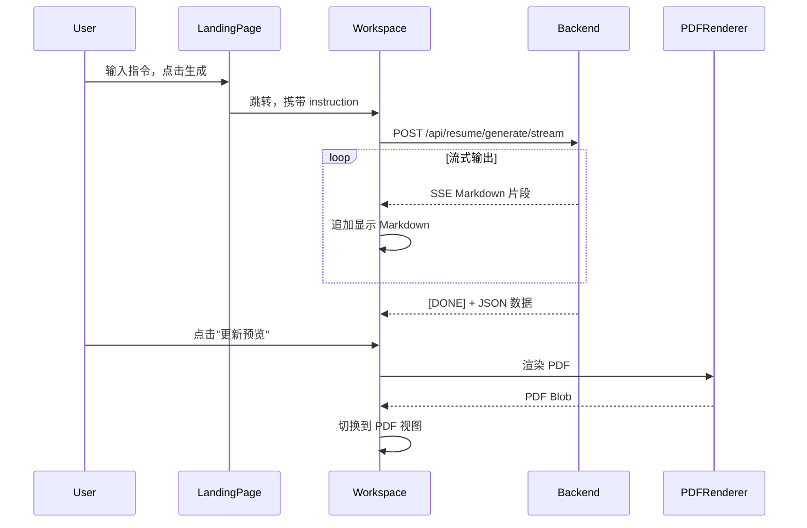

# 流式简历生成功能

## 整体流程



## 一、后端：新增流式生成接口

**文件：** [backend/routes/resume.py](backend/routes/resume.py)

新增 `/api/resume/generate/stream` 接口：

- 接收 instruction 和 locale 参数
- 流式输出 Markdown 格式的简历内容（按模块顺序）
- 最后发送 `[DONE]` 和完整的 JSON 数据

**Markdown 输出格式示例：**

```markdown
# 张三

**电话：** 13800138000 | **邮箱：** zhangsan@example.com

---

## 教育经历

**华南理工大学** - 计算机科学与技术（本科）
2020.09 - 2024.06

---

## 工作经历
...
```

## 二、前端：右侧面板改造

### 2.1 新增状态

**文件：** [frontend/src/pages/Workspace/hooks/useWorkspaceState.ts](frontend/src/pages/Workspace/hooks/useWorkspaceState.ts)

```typescript
// 新增状态
const [rightView, setRightView] = useState<'pdf' | 'ai-output'>('pdf')
const [aiOutput, setAiOutput] = useState<string>('')  // 流式 Markdown
const [aiGenerating, setAiGenerating] = useState(false)
const [pendingResumeJson, setPendingResumeJson] = useState<Resume | null>(null)
```

### 2.2 新增 AI 输出组件

**新文件：** `frontend/src/pages/Workspace/components/AIOutputView.tsx`

- 显示流式 Markdown 内容
- 使用 react-markdown 渲染
- 底部显示"更新预览"按钮（输出完成后启用）
- 加载中显示动画

### 2.3 修改 Workspace 右侧面板

**文件：** [frontend/src/pages/Workspace/index.tsx](frontend/src/pages/Workspace/index.tsx)

```tsx
{/* 右侧面板内容 */}
{state.rightView === 'ai-output' ? (
  <AIOutputView
    content={state.aiOutput}
    loading={state.aiGenerating}
    onUpdatePreview={handleUpdatePreview}
  />
) : (
  <PDFViewer ... />
)}
```

### 2.4 新增 API 函数

**文件：** [frontend/src/services/api.ts](frontend/src/services/api.ts)

```typescript
export async function generateResumeStream(
  instruction: string,
  locale: string,
  onChunk: (markdown: string) => void,
  onComplete: (resume: Resume) => void,
  onError: (error: string) => void
)
```

### 2.5 修改初始化逻辑

**文件：** [frontend/src/pages/Workspace/index.tsx](frontend/src/pages/Workspace/index.tsx)

从首页跳转时：

1. 设置 `rightView = 'ai-output'`
2. 调用流式 API
3. 流式更新 `aiOutput`
4. 完成后设置 `pendingResumeJson`
5. 用户点击"更新预览" → 渲染 PDF → 切换到 `rightView = 'pdf'`

## 三、依赖安装

```bash
cd frontend && npm install react-markdown
```

## 文件清单

| 操作 | 文件 |

|------|------|

| 修改 | backend/routes/resume.py |

| 修改 | frontend/src/pages/Workspace/hooks/useWorkspaceState.ts |

| 修改 | frontend/src/pages/Workspace/index.tsx |

| 修改 | frontend/src/services/api.ts |

| 新增 | frontend/src/pages/Workspace/components/AIOutputView.