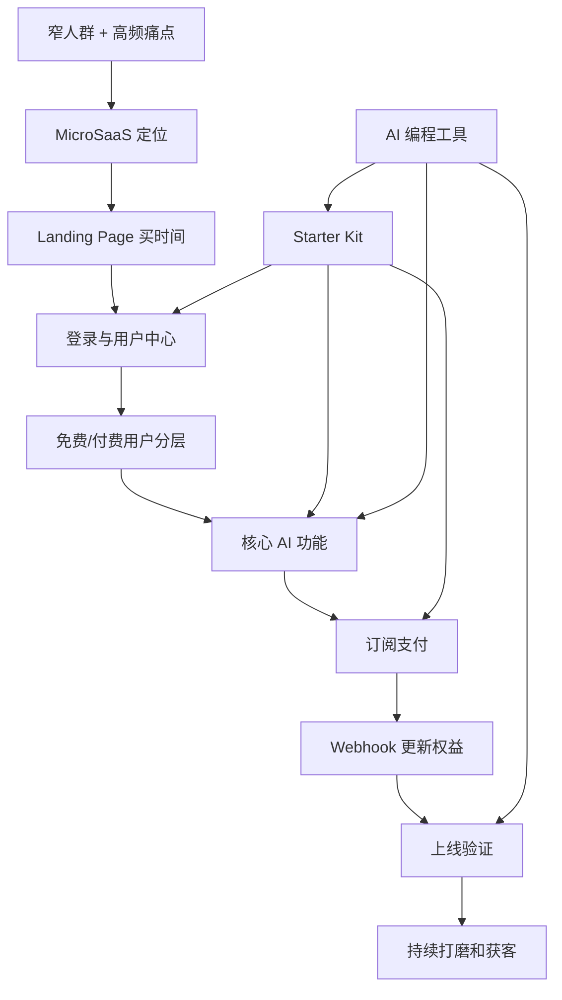

# 00 知识地图

## 产品链路总图

## 三层结构

战略层：

- [MicroSaaS 产品判断](01-microsaas-product.md)
- [Landing Page 与首屏转化](02-landing-page.md)

基础设施层：

- [用户中心、登录与权限](03-auth-user-center.md)
- [海外支付、订阅与 Webhook](04-payment-webhook.md)
- [Starter Kit 与技术底座](05-starter-kit.md)

执行层：

- [AI 编程实操流程](06-ai-dev-workflow.md)
- [上线与打磨清单](07-launch-checklist.md)
- [任务 Playbook](09-playbooks.md)
- [提示词模板](10-prompts-and-templates.md)

## 最重要的因果关系

没有高频痛点，订阅就没有理由。

没有清晰首屏，用户不会进入试用。

没有登录，无法区分匿名、免费、付费用户。

没有支付和 Webhook，收钱和开通权益无法闭环。

没有 Starter Kit，早期会把时间浪费在低差异化基础设施上。

没有真实验收，AI 写出的代码不等于产品可上线。

## 推荐学习路径

从 0 到 1：

1. [01 MicroSaaS 产品判断](01-microsaas-product.md)
2. [02 Landing Page 与首屏转化](02-landing-page.md)
3. [05 Starter Kit 与技术底座](05-starter-kit.md)
4. [06 AI 编程实操流程](06-ai-dev-workflow.md)
5. [07 上线与打磨清单](07-launch-checklist.md)

从已有产品到商业化：

1. [03 用户中心、登录与权限](03-auth-user-center.md)
2. [04 海外支付、订阅与 Webhook](04-payment-webhook.md)
3. [09 Playbook 3: 接入订阅支付](09-playbooks.md#playbook-3-接入订阅支付)
4. [07 上线与打磨清单](07-launch-checklist.md)

从技术模板到产品：

1. [05 Starter Kit 与技术底座](05-starter-kit.md)
2. [06 AI 编程实操流程](06-ai-dev-workflow.md)
3. [10 提示词模板](10-prompts-and-templates.md)
4. [02 Landing Page 与首屏转化](02-landing-page.md)
