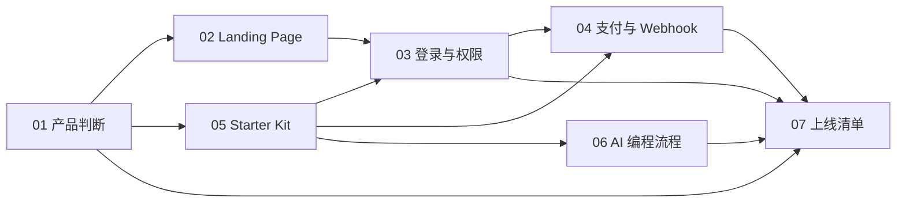

# 11 关系图谱

## 模块依赖

## 双向引用索引

### 01 MicroSaaS 产品判断

被这些模块使用：

- [02 Landing Page](02-landing-page.md)：首屏文案来自产品定位。
- [04 支付](04-payment-webhook.md)：订阅是否成立取决于高频问题。
- [06 AI 编程](06-ai-dev-workflow.md)：MVP 需求来自产品判断。

### 02 Landing Page

依赖：

- [01 MicroSaaS 产品判断](01-microsaas-product.md)：明确人群和问题。

影响：

- [03 用户中心](03-auth-user-center.md)：把用户引导到登录。
- [07 上线清单](07-launch-checklist.md)：上线前检查首屏和 CTA。

### 03 用户中心、登录与权限

依赖：

- [05 Starter Kit](05-starter-kit.md)：通常由模板提供基础认证。

影响：

- [04 支付](04-payment-webhook.md)：支付后要更新用户权益。
- [07 上线清单](07-launch-checklist.md)：验收匿名、免费、付费用户路径。

### 04 支付、订阅与 Webhook

依赖：

- [03 用户中心](03-auth-user-center.md)：必须知道给谁开通权益。
- [05 Starter Kit](05-starter-kit.md)：支付路由和订阅表通常由模板提供或扩展。

影响：

- [07 上线清单](07-launch-checklist.md)：支付闭环是上线关键。

### 05 Starter Kit

影响：

- [03 用户中心](03-auth-user-center.md)
- [04 支付](04-payment-webhook.md)
- [06 AI 编程](06-ai-dev-workflow.md)

作用：

降低基础设施成本，让开发者专注核心功能和流量。

### 06 AI 编程实操流程

依赖：

- [01 产品判断](01-microsaas-product.md)：决定需求。
- [05 Starter Kit](05-starter-kit.md)：决定项目结构。

影响：

- [07 上线清单](07-launch-checklist.md)：实现后必须用真实路径验收。

### 07 上线与打磨清单

汇总依赖：

- 产品定位是否清楚。
- 页面是否能转化。
- 登录和权限是否正确。
- 支付 Webhook 是否闭环。
- AI 功能是否可用。
- 部署和环境变量是否正确。
