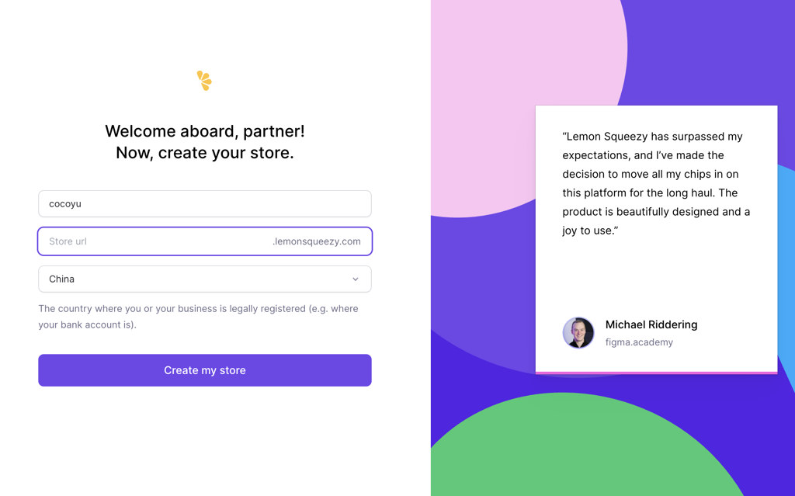
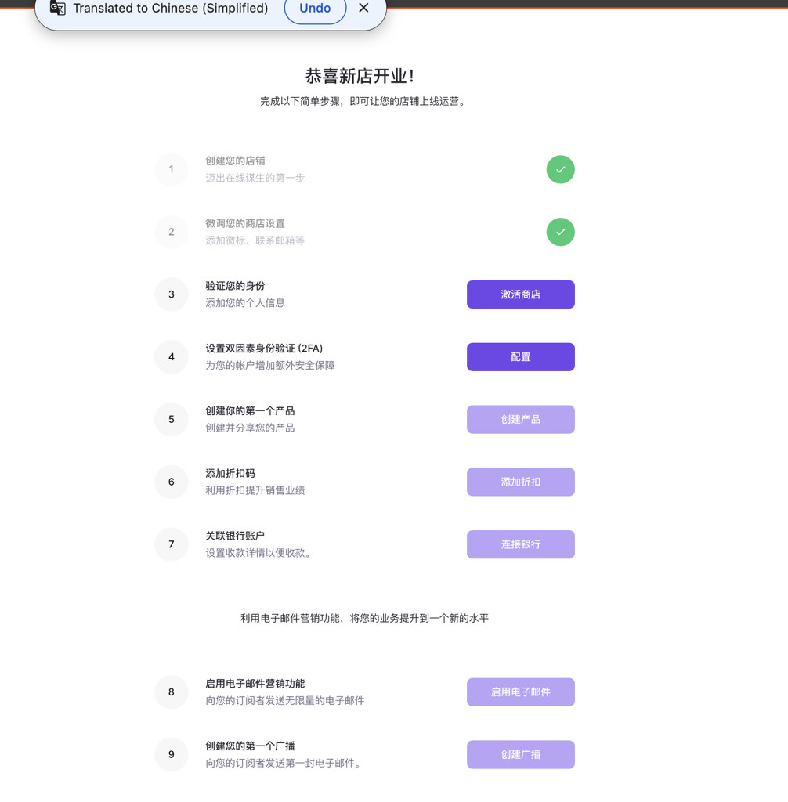
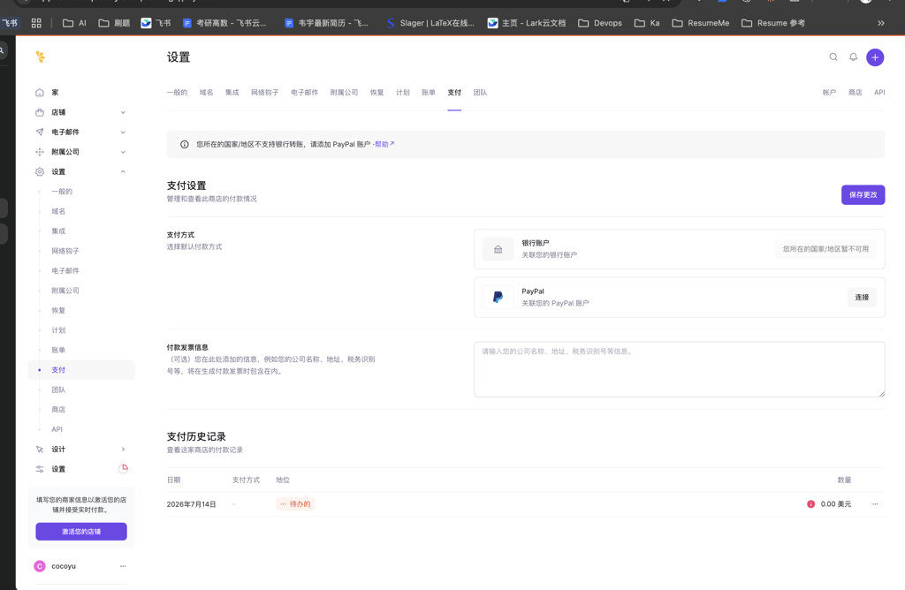
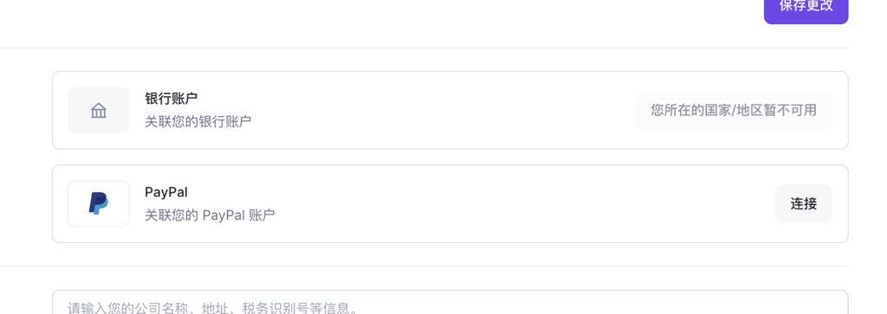
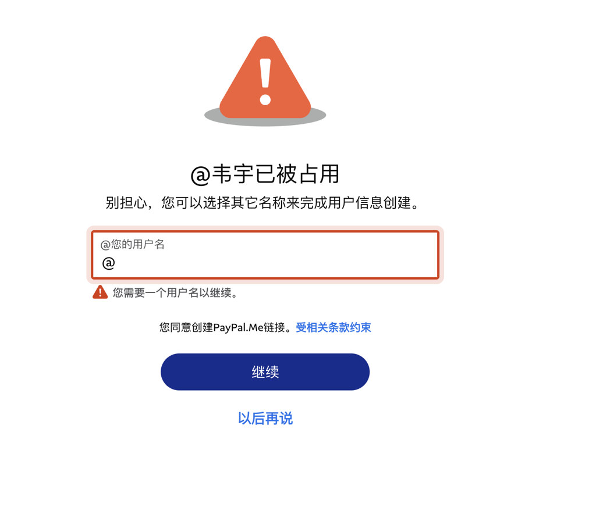
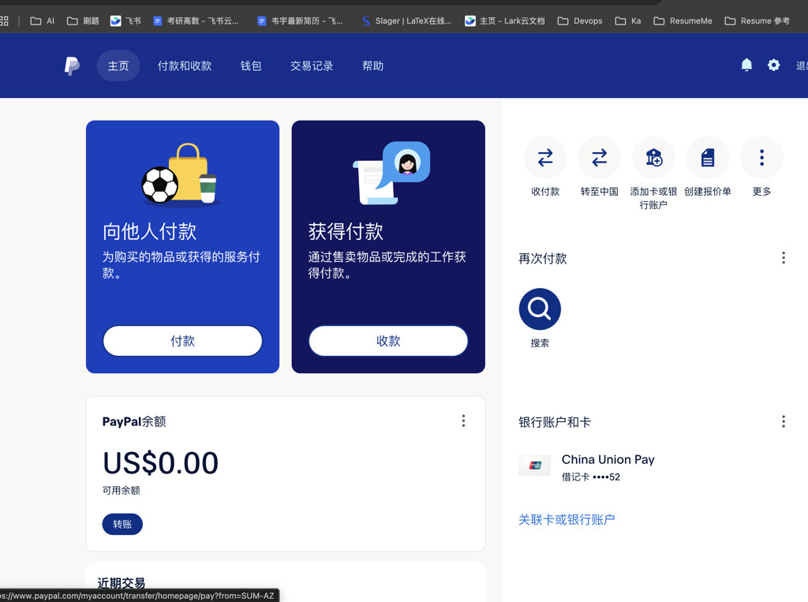

# Lemon Squeezy + PayPal 接入实录（大陆个人开发者）

> 日期：2026-06-20  
> 操作人：coco yu（weiyu9484@gmail.com）  
> 项目：Resume-Agent  
> 分支：`feature/06-20/01`  
> 当前状态：Lemon Squeezy 店铺已创建；PayPal 已注册并绑卡；**待连接 Lemon Squeezy ↔ PayPal、创建产品、写 Webhook 代码**

## 背景

Resume-Agent 面向海外 AI 产品场景，需要收款能力。作为**中国大陆个人开发者、无公司主体**：

- **Stripe Live**：不支持大陆主体直接注册
- **微信/支付宝商户 API**：需要营业执照（个体工商户或公司）
- **Lemon Squeezy**：个人可注册；用户结账支持信用卡 / PayPal / 支付宝 / 微信（一次性购买）；大陆卖家收款走 **PayPal**

本文记录 2026-06-20 实际操作过程与截图，供后续开发与运维参考。

---

## 关键结论（先看这个）

| 问题 | 结论 |
|------|------|
| 大陆个人能用 Lemon Squeezy 吗？ | ✅ 可以注册店铺 |
| 大陆卖家怎么收钱？ | **PayPal**（银行转账不可用） |
| 国内用户能用微信支付吗？ | ✅ 一次性购买可以；**订阅不行** |
| PayPal.Me 用户名 | 最终使用 **`cocoyuResume`** |
| 当前卡在哪里？ | PayPal 已绑银联借记卡 `****52`，余额 $0.00 |

---

## 流程总览

```text
1. 注册 Lemon Squeezy → 创建店铺（国家选 China）
2. 完成店铺基础设置
3. 发现大陆不支持银行收款 → 改走 PayPal
4. 注册 PayPal 中国版 → 绑银联卡
5. 设置 PayPal.Me 用户名 cocoyuResume
6. 【当前】PayPal 主页就绪
7. 【待做】回 Lemon Squeezy 连接 PayPal
8. 【待做】激活商店 + 创建产品 + API Key + Webhook
9. 【待做】Resume-Agent 后端/用户中心接入
```

---

## 第 1 步：注册并创建 Lemon Squeezy 店铺

**入口**：https://app.lemonsqueezy.com/register

填写内容：

| 字段 | 实际填写 |
|------|----------|
| 店铺名 | `cocoyu` |
| Store URL | 自定义子域（如 `xxx.lemonsqueezy.com`） |
| 国家 | **China**（表示商家在中国，与收款方式相关） |



点击 **Create my store** 后店铺创建成功。

---

## 第 2 步：新店开业检查清单

登录后进入 onboarding 页面，显示 9 项任务。当时已完成前两步：

| # | 任务 | 状态（截图时） |
|---|------|----------------|
| 1 | 创建您的店铺 | ✅ 已完成 |
| 2 | 微调您的商店设置 | ✅ 已完成 |
| 3 | 验证您的身份（激活商店） | ⏳ 待做 |
| 4 | 设置双因素身份验证 (2FA) | ⏳ 待做 |
| 5 | 创建您的第一个产品 | ⏳ 待做 |
| 6 | 添加折扣码 | 可选 |
| 7 | 关联银行账户 | ⏳ 待做 |
| 8–9 | 电子邮件营销 | 可跳过 |



---

## 第 3 步：发现大陆收款限制

进入 **设置 → 支付**，页面明确提示：

> **您所在的国家/地区不支持银行转账，请添加 PayPal 账户**

| 收款方式 | 大陆可用性 |
|----------|-----------|
| 银行账户 | ❌ 暂不可用 |
| PayPal | ✅ 可连接 |

底部还有提示：需填写商家信息并 **激活店铺** 后才能接受实时付款。





**处理方式**：忽略银行账户，改为注册并连接 PayPal。

---

## 第 4 步：注册 PayPal 并绑卡

**入口**：https://www.paypal.com/c2

操作：

1. 用国内手机号 + 邮箱注册 **个人账户**
2. 完成实名认证
3. 绑定银联借记卡（截图显示已绑定 `****52`）

### PayPal.Me 用户名

系统要求设置 PayPal.Me 链接用户名：

- 尝试 `@韦宇` → **已被占用**
- 最终选用：**`cocoyuResume`** ✅



PayPal.Me 链接形如：`https://paypal.me/cocoyuResume`（用于个人收款短链，与 Lemon Squeezy 授权无强依赖，可设可不设）。

---

## 第 5 步：当前状态 — PayPal 主页

截至 2026-06-20，PayPal 主页状态：

| 项目 | 值 |
|------|-----|
| PayPal 余额 | **US$0.00** |
| 已绑卡 | 银联借记卡 `****52` |
| 主页功能 | 付款 / 收款 / 转账 / 关联卡 |



---

## 资金路径（大陆卖家）

```text
海外/国内用户付款（USD）
    ↓
Lemon Squeezy 收银台（信用卡 / PayPal / 微信 / 支付宝 等）
    ↓
Lemon Squeezy 扣平台手续费（约 5%–8%）
    ↓
结算到卖家 PayPal 账户
    ↓
PayPal 提现到国内银联卡（约 2%–3.5% 手续费）
```

---

## 待办清单（下一步）

### A. Lemon Squeezy 侧

- [ ] **设置 → 支付 → PayPal → 连接**（用刚注册好的 PayPal 登录授权）
- [ ] 点击 **保存更改**
- [ ] 首页 checklist：**激活商店**（身份验证）
- [ ] 配置 **2FA**（建议）
- [ ] **创建第一个产品**（建议一次性额度包，非订阅）：
  - 名称：Resume Agent — 50 AI Credits
  - 价格：$4.99
  - 类型：**Single payment**
- [ ] **Settings → API** 创建 API Key
- [ ] **Settings → Webhooks** 创建 Webhook（事件：`order_created`）

### B. Resume-Agent 代码侧

- [ ] `POST /api/billing/lemonsqueezy/checkout`
- [ ] `POST /api/billing/lemonsqueezy/webhook` → 更新 `better_auth_entitlements.credits`
- [ ] `/account` 用户中心「购买额度」按钮

详见：`knowledge-base/plans/2026-06-20-auth-commercialization-roadmap.md`

---

## 环境变量（预留）

```bash
# Lemon Squeezy
LEMONSQUEEZY_API_KEY=
LEMONSQUEEZY_STORE_ID=
LEMONSQUEEZY_VARIANT_ID=          # 额度包 Variant ID
LEMONSQUEEZY_WEBHOOK_SECRET=

# 无需 Stripe（大陆个人当前不走 Stripe Live）
```

---

## 踩坑记录

| 问题 | 原因 | 解决 |
|------|------|------|
| 银行账户灰色不可用 | Lemon Squeezy 不支持大陆银行转账收款 | 改接 PayPal |
| `@韦宇` 用户名占用 | PayPal.Me 全球唯一 | 改用 `cocoyuResume` |
| 能否用微信支付收款？ | 混淆了「卖家收款」和「买家付款」 | 卖家收 PayPal；买家可用微信付（一次性） |
| 派安盈是否必须？ | 本账号 LS 后台仅展示 PayPal | 以 Dashboard 实际选项为准 |

---

## 相关文档

- 商业化路线图：`knowledge-base/plans/2026-06-20-auth-commercialization-roadmap.md`
- 付费模型设计：`knowledge-base/specs/2026-03-31-monetization-model.md`
- BetterAuth 认证层：`knowledge-base/plans/2026-06-19-nextjs-betterauth-auth-layer.md`
- Lemon Squeezy 支付方式官方文档：https://docs.lemonsqueezy.com/help/checkout/payment-methods

---

## 变更记录

| 日期 | 事件 |
|------|------|
| 2026-06-20 | 注册 Lemon Squeezy，店铺名 cocoyu，国家 China |
| 2026-06-20 | 确认大陆仅 PayPal 收款 |
| 2026-06-20 | 注册 PayPal，绑银联卡，PayPal.Me = cocoyuResume |
| 2026-06-20 | 撰写本实录文档 |