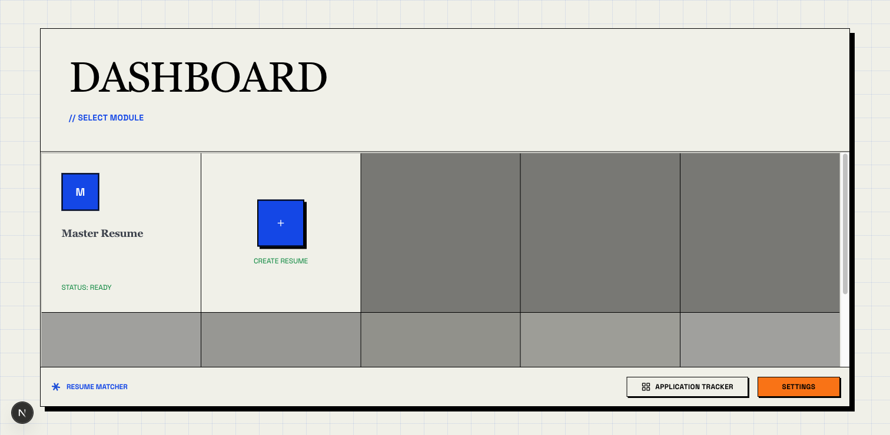
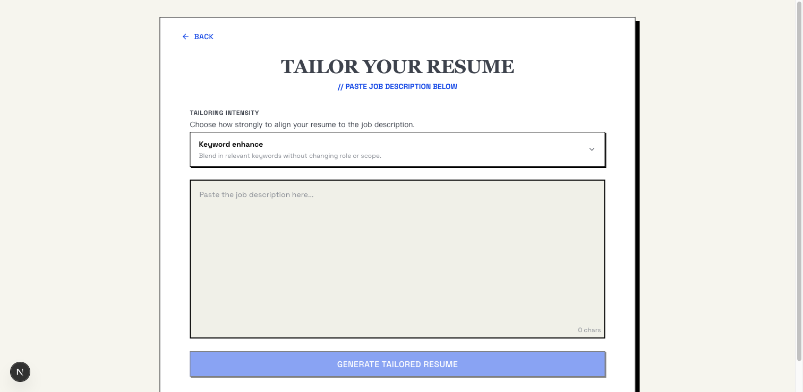
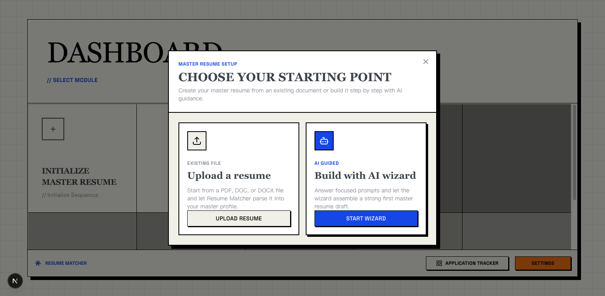
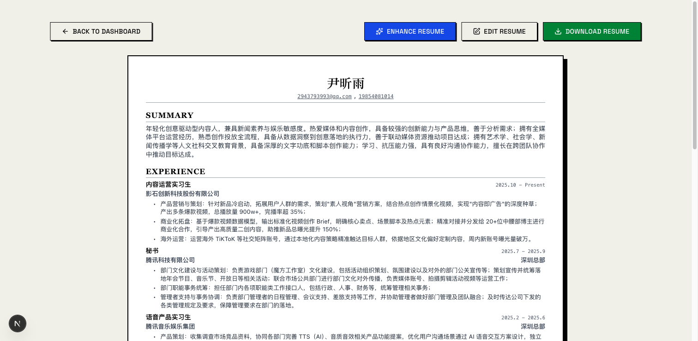
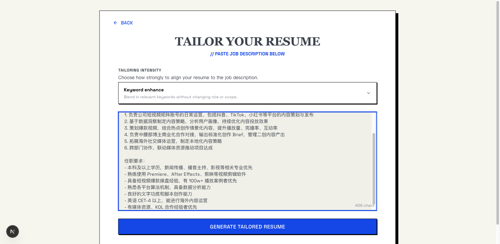
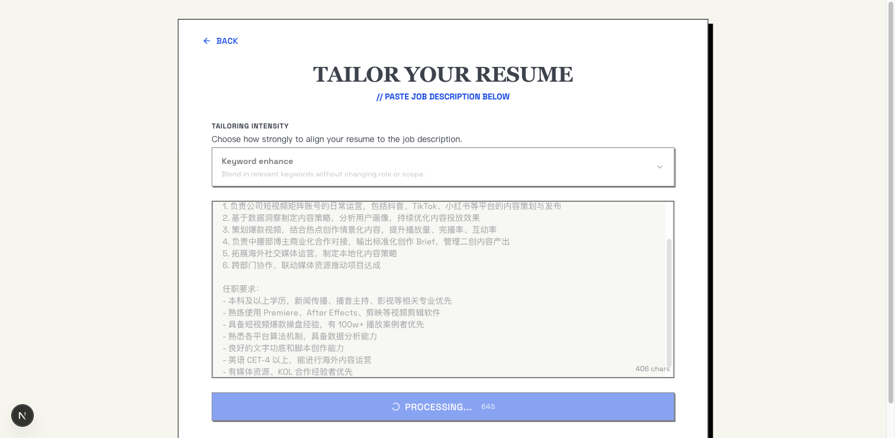
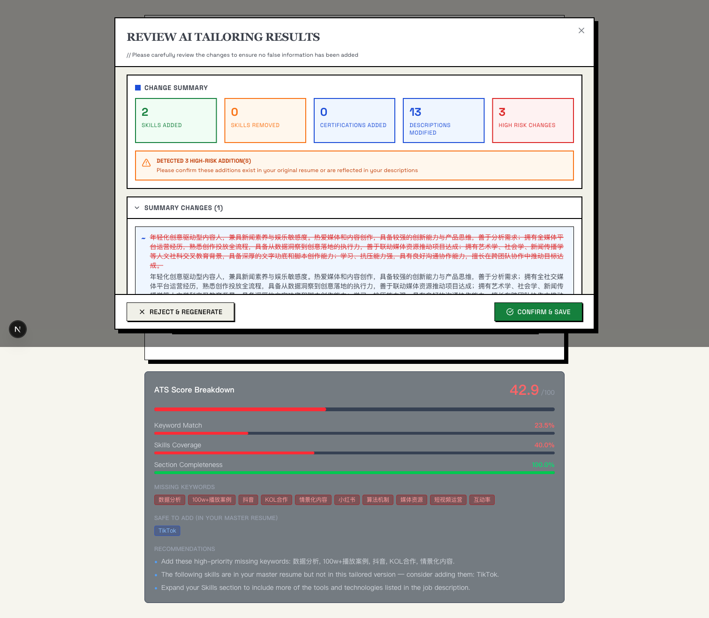
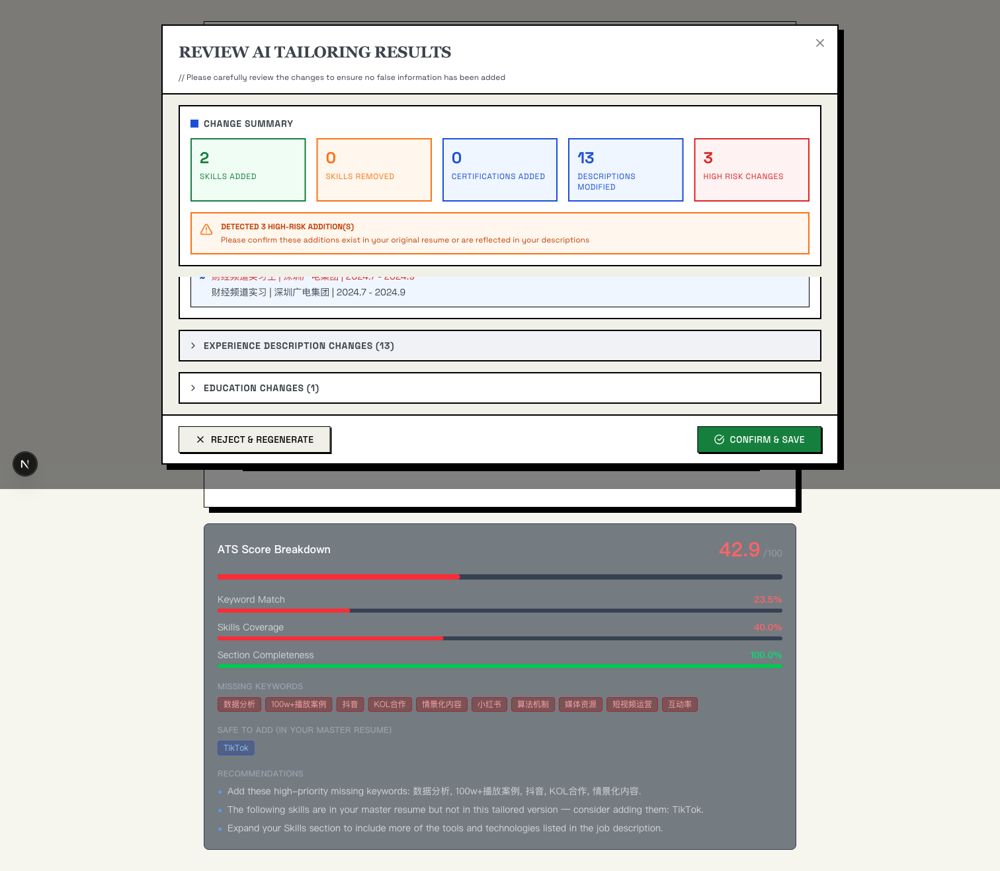
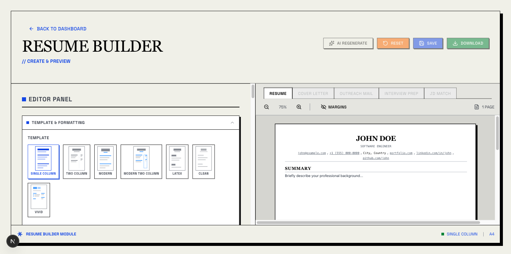
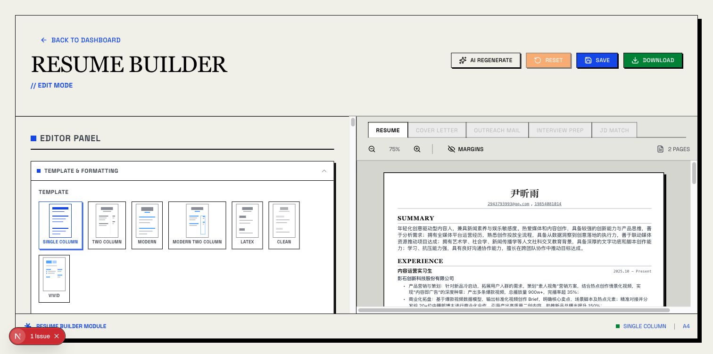

# Resume-Matcher AI 功能实体验流程记录

- **日期**：2026-07-08
- **目的**：实机体验 RM 的核心 AI 功能（PDF 解析、JD 匹配定制、diff 审阅），截图归档
- **环境**：本地 RM（前端 3000 / 后端 8000），LLM = qwen-plus-latest（复用 ResumeAgent 的 DashScope key），content_language=zh
- **样本**：`测试样本/尹昕雨 3.pdf`（播音主持专业、内容运营实习简历）
- **截图目录**：`knowledge-base/reviews/assets/rm-ai-demo/`

---

## 一、配置确认（已就绪）

RM 配置存 SQLite（`apps/backend/data/resume_matcher.db`）+ config.json，启动前确认：

| 配置项 | 值 |
|---|---|
| provider | `openai_compatible` |
| model | `qwen-plus-latest` |
| api_base | `https://dashscope.aliyuncs.com/compatible-mode/v1` |
| content_language | `zh` |
| default_prompt_id | `keywords`（融入关键词档） |
| enable_cover_letter / outreach / interview_prep | 全 true |
| LLM 健康 | `healthy: true` |

**prompt 已写入**（无需额外操作）——RM 的 improver/refiner/cover_letter/interview_prep prompt 都硬编码在 `app/prompts/templates.py`，用户可在 settings 覆盖 `cover_letter_prompt`/`outreach_message_prompt`（留空走默认）。

---

## 二、体验流程（12 张截图）

### 步骤 1：Dashboard 初始态



首次进入，"Master Resume" 状态 Ready 但未创建。"Create Resume" 灰，必须先初始化 Master Resume。

### 步骤 2：点 Create Resume 跳到 Tailor 页（无 Master 时不可用）



Tailor 页是 JD 定制入口，但 "Generate Tailored Resume" disabled——因为没 Master Resume 作基准。

### 步骤 3：选择初始化方式（Upload vs Wizard）



RM 的产品决策点：**Upload Resume**（解析现有 PDF/DOCX） vs **Build with AI wizard**（对话式 AI 引导）。两者都能建 Master Resume。本次选 Upload（更快）。

> 这是值得借鉴的产品设计——给用户两条路径，有简历的上传、没简历的对话引导。

### 步骤 4：上传 PDF 触发 AI 解析


上传 `尹昕雨 3.pdf`，后端走 `parse_document`（MarkItDown 抽文本）→ `parse_resume_to_json`（LLM 转 JSON）→ `restore_dates_from_markdown`（正则回填日期）。

### 步骤 5：解析结果——Master Resume 就绪



**AI 解析质量很好**：姓名"尹昕雨"、Summary（完整自我评价）、Experience/Education/Projects/Skills & Awards 都正确提取。RM 的 `parse_resume_to_json` + `RESUME_SCHEMA_EXAMPLE` prompt 设计有效。

### 步骤 6：进入 Tailor，填 JD



填入匹配的内容运营 JD（短视频矩阵/TikTok/爆款视频/博主商业化/海外运营）。底部 "Tailoring intensity" 选 Keyword enhance（轻改档）。

### 步骤 7：Generate 触发 AI 定制流水线（多步 LLM）



后端流水线（约 30-40s）：
1. `extract_job_keywords`（LLM 抽 JD 关键词）
2. `generate_skill_target_plan` + `verify_skill_target_plan`（LLM 提议技能 + 本地校验分类）
3. `generate_resume_diffs`（LLM 出变更列表）
4. `apply_diffs`（本地 4 闸门审核）
5. `verify_diff_result`（本地质检）
6. `refine_resume`（关键词注入 + 去 AI 味 + master 对齐）

**后端日志实证 diff 机制在真实运行**：
```
Diff rejected (original mismatch): path=workExperience[0].description[0]
  expected='...策划"素人视角"营销方案...'
  actual='...策划"素人视角"营销方案...'  ← 全角/半角引号差异被拒
Diff reorder salvaged (item-set mismatch): additional.technicalSkills
Reorder salvage dropped unverified skill: Audition / DaVinci Resolve / Canva / Xiumi / Office
Diff rejected (duplicate skill): After Effects
Diff-based improve: 4 applied, 5 rejected, 1 warnings
Alignment violations found - removing fabricated content: ['office办公软件']
Injecting 1 keywords: ['TikTok']
```

这正是我们调研报告 H1 描述的"LLM 提议 + 本地守门"机制——每条变更都要过 path 白名单 + 原文匹配 + 重名检测 + 虚构内容清洗四道闸门。

### 步骤 8：Review AI Tailoring Results（diff 审阅弹窗 —— 精华界面）



RM 的核心展示：**把每条 AI 变更分类展示，用户可逐类审阅**：
- Summary Changes (1)
- Skill Changes (2)
- Experience Entry Changes (3)
- Experience Description Changes (13)
- Education Changes (1)
- Project Changes (1)
- Award Changes (2)

底部 "Reject & Regenerate" / "Confirm & Save"。这是 diff-based 定制的 UX 价值——用户能看到改了什么、可控。

### 步骤 9：展开看具体 diff（原文 → 改后文）



展开 "Experience Description Changes (13)"，每条变更展示原文与改后文的对比。可勾选接受/拒绝单条。

### 步骤 10-12：Builder 编辑器（格式控制 + 模板切换）



Builder 的格式控制面板（**这是 ResumeAgent Builder 已借鉴的核心**）：
- 7 套模板缩略图选择（Single Column/Two Column/Modern/Modern Two Column/LaTeX/Clean/Vivid）
- Page Size（A4 / US Letter）
- 4 向边距滑块（5-25mm）
- 间距 5 档（Section/Items/Lines）
- 字号 5 档（Base/Headers）+ 字体（Serif/Sans/Mono）
- Compact Mode / Contact Icons 开关
- **Effective Output 实时显示生效值**（Margins/Section Gap/Item Gap/Line Height/Base Font/Header Scale/Header Font/Body Font）



加载 master resume 后的 Builder（左编辑右分页预览）。顶部 5 个 Tab：RESUME（激活）/ COVER LETTER / OUTREACH MAIL / INTERVIEW PREP / JD MATCH——**后四个 disabled**，因为这些 AI 功能依赖"先有 JD 定制结果（tailored resume）"，而我们这次 confirm 失败了（见下节）。

---

## 三、发现的 RM Bug（confirm hash 校验失败）

### 现象

点 Confirm & Save 持续返回 400：`Invalid improved resume data. Please retry preview`。

### 根因

后端日志：`Resume confirm rejected: personalInfo fields changed: name`

RM 的 confirm 安全机制：preview 时算 hash 存 job，confirm 时重算 hash 必须字节级匹配；同时 `_validate_confirm_payload` 校验 personalInfo 不可变。

但 LLM 在 preview 阶段把 `name` 字段也改了（虽然 prompt 明确"Do NOT include personalInfo"）。LLM 不听话 → name 变了 → confirm 校验失败。

### 教训（印证调研报告 H1）

这正是为什么 RM 在 `_improve_preview_flow` 里有 `_preserve_personal_info()` 硬保底——但显然在某些情况下没生效（可能 LLM 改的不是 personalInfo 块而是其他地方透传的 name）。

**对 ResumeAgent 的警示**：做 diff-based 定制时，personalInfo 必须用"白名单只允许改业务字段"的硬隔离，不能依赖 prompt 规劝 LLM 别动。RM 这个 bug 是反面教材。

---

## 四、本次体验覆盖的 AI 功能

| 功能 | 体验了？ | 截图 | 评价 |
|---|---|---|---|
| PDF 解析（MarkItDown + LLM） | ✅ | 05/06 | 质量好，姓名/Summary/各 section 都正确 |
| JD 关键词抽取 | ✅（后端日志） | — | 抽出 TikTok 等关键词 |
| 技能补全两步法（LLM 提议 + 本地校验） | ✅（后端日志） | — | 拒绝了 Audition/DaVinci 等未验证技能 |
| Diff-based 定制（4 闸门） | ✅（后端日志 + UI） | 09/10 | 4 applied / 5 rejected，机制有效 |
| diff 审阅弹窗 | ✅ | 09/10 | 精华 UX，分类展示 + 逐条审阅 |
| Confirm & Save（hash 校验） | ❌（bug） | — | LLM 改了 name 导致校验失败 |
| 去 AI 味（本地后处理） | ✅（后端日志） | — | 删了"office办公软件"虚构内容 |
| 关键词注入 | ✅（后端日志） | — | 注入了 TikTok |
| 求职信生成 | ❌（依赖 confirm） | — | tab disabled |
| 外联消息生成 | ❌（依赖 confirm） | — | tab disabled |
| 面试准备 | ❌（依赖 confirm） | — | tab disabled |
| ATS 评分 | ❌（依赖 confirm） | — | tab disabled |
| 对话式 Wizard | ❌（走 Upload 路径） | — | 未体验 |
| Enhance Resume | ❌（未点） | — | 未体验 |

---

## 五、对 ResumeAgent 的启示（结合实体验）

### 已验证值得借鉴的（调研报告 H 项得到实证）

1. **H1 diff-based 定制真实有效**——后端日志显示 4 applied / 5 rejected，4 闸门真的拦下了不合规变更（全角半角不匹配、重复技能、未验证技能）。这套机制比 agent 整体改写可控得多。
2. **diff 审阅弹窗是好 UX**——分类展示变更（Summary/Skill/Experience/Education/Project/Award），用户逐类审阅，比"整体重写后给个对比"清晰。
3. **AI 解析质量好**——MarkItDown + LLM + 日期回填的组合，对中文简历解析准确。
4. **格式控制面板体验佳**——7 套模板缩略图 + 4 向边距 + 5 档间距 + Effective Output 实时显示，ResumeAgent Builder 已借鉴。

### 新发现的注意点

1. **personalInfo 硬隔离是必须的**——RM 这个 bug 证明光靠 prompt 规劝 LLM 别动 name 不够，要做白名单硬隔离。
2. **hash 校验机制敏感**——preview 后必须快速 confirm，且不能让用户在 review 过程中改东西（否则 hash 失效）。RM 这个 UX 有改进空间。
3. **AI 功能有依赖链**——cover letter/outreach/interview prep/ATS 都依赖"先有 tailored resume"。产品流程设计上要先打通主链路（JD 定制），支线功能才有意义。

### ResumeAgent 当前可立即学的

- **格式控制面板的 Effective Output**（实时显示生效值）——ResumeAgent Builder 已抄但可核对完整度
- **diff 审阅的分类展示 UX**——若做 H1 diff-based 定制，这个 UI 模式直接抄
- **AI 解析的日期回填**（`restore_dates_from_markdown`）——补到 `assemble_resume_data_fast` 后处理

---

## 六、协议说明

截图来自本地运行的 Resume-Matcher（Apache-2.0），仅用于内部调研归档，未分发。
