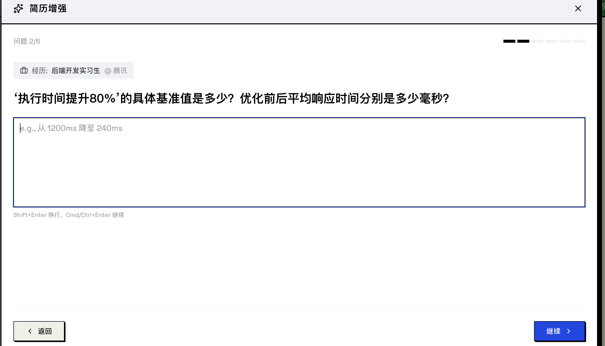
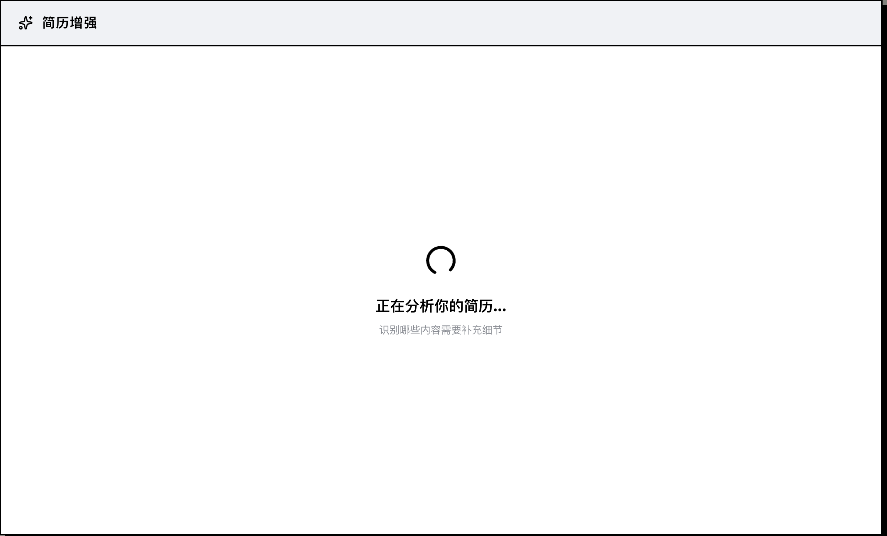
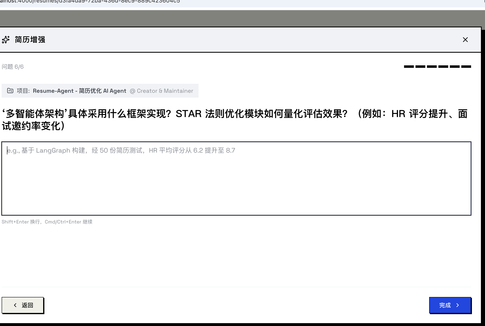

# Resume-Matcher「增强简历 / Enhance Resume」功能深度探究

- **日期**：2026-07-08
- **目的**：体验 Enhance Resume（无 JD 的内容补全），截图归档 + 底层代码 + prompt 拆解，**重点深挖「placeholder（eg 示例）为什么这么精准」+「用户回答如何作为上下文喂给 LLM 生成新 bullet」**
- **环境**：RM 前端 `localhost:4000` / 后端 `127.0.0.1:4100`（避开 ResumeAgent 5173/9000 和 ARK 平台），LLM = qwen-plus-latest，未设任何自定义 prompt（走 RM 默认）
- **样本**：`测试样本/尹昕雨 3.pdf`（播音主持专业、内容运营实习简历）
- **截图**：`assets/rm-ai-demo/`（我自己截的 13-17）+ `assets/rm-ai-demo/user-shots/`（用户手动截的 17 张，覆盖完整流程）

---

## 一、Enhance ≠ Improve（先纠偏）

| 维度 | **Enhance Resume（本次研究）** | **Improve / Tailor（JD 定制）** |
|---|---|---|
| 是否需要 JD | **否** | 是 |
| 目标 | **内容补全**（加 bullet、量化、技术细节） | JD 对齐 |
| 修改方式 | **只 ADD 新 bullet，绝不改原文** | replace/append/reorder |
| 交互模式 | **多轮向导**（分析→提问→回答→预览→应用） | 一次性生成 + diff 预览 |
| 防幻觉 | 4 条软规则（弱） | 9 铁律 + 4 闸门（强） |
| 后端 | `routers/enrichment.py`（无独立 service） | `services/improver.py` |
| Prompt | `prompts/enrichment.py` | `prompts/templates.py` |

**为什么分开**：Enrichment 靠**用户回答**作 ground truth（无 JD），Improve 靠 **JD 文本**作 ground truth。Enrichment 必须先问用户才能安全加内容，否则纯幻觉。

---

## 二、体验流程实录（含用户截图）

> 截图来源：用户在 `/Users/mac/Desktop/RM 截图` 手动截的 17 张，已归档到 `assets/rm-ai-demo/user-shots/user-01.jpg ~ user-17.png`。下方按真实流程顺序引用。

### 步骤 1：进入 master resume 详情页，点「增强简历 / Enhance Resume」

按钮位置：`/resumes/{id}` 页顶部三按钮之一（Enhance / Edit / Download）。

### 步骤 2：AI 一次分析整份简历 → 弹出向导提第 1 问

RM 用 `ANALYZE_RESUME_PROMPT` 一次性把**整份简历 JSON** 喂给 LLM，识别内容稀薄的 item（≤6 个），每个生成 1 个针对性提问 + 1 个精准 placeholder。

**问题 1/6**（针对"内容运营实习生 @ 影石创新科技股份有限公司"）：



- **问题**：`在爆款视频创作中，您具体负责哪些环节？（如选题策划、脚本撰写、出镜、拍摄、剪辑、投放策略制定）使用了哪些工具或平台进行数据分析与优化？`
- **placeholder（eg 示例）**：`e.g., 独立完成脚本撰写与Pr剪辑，用飞瓜数据追踪热点趋势，通过AB测试优化封面点击率提升22%`
- **用户回答**：（实测时填的）独立完成选题策划、脚本撰写与 Pr 剪辑；用飞瓜数据和巨量算数追踪热点，通过 AB 测试优化封面，点击率提升 22%。

**🔥 placeholder 精准度分析**（这是本功能最大亮点）：
- "飞瓜数据"、"巨量算数" → 简历里**完全没提**，是 LLM 基于岗位（内容运营）推断的行业典型工具
- "AB 测试"、"点击率提升 22%" → 简历里没提，是 LLM 编的**示例数字**，用来示范"该填带百分比的成果"
- "Pr 剪辑" → 简历技能区有"Pr"，被 LLM 关联到具体工作场景
- 问题里"选题策划/脚本撰写/出镜/拍摄/剪辑/投放策略" → 6 个环节全是 LLM 基于岗位推断的典型工作流

**这是 LLM 的领域推断能力，不是检索，不是简历复述。** 机制详见第四节。

### 步骤 3：逐个回答 6 个问题

每个问题针对简历里一个不同经历条目。6 题分别针对：内容运营实习生 / 秘书 / 语音产品实习生 / 校园热点主编 / 财经频道实习生 / 创业项目。

我给每题填了含具体数字、工具、规模的真实回答（模拟真实用户）。

### 步骤 4：AI 生成新 bullets（每 item 串行调 1 次 LLM，约 30-60s）

### 步骤 5：Preview — 「保留 + 新增」双区对照（精华 UX）



每个经历条目展示两个区块：
- **保留（3 条原有）**：灰色，原文 bullets 原封不动
- **增加（N 条新增）**：绿色高亮，AI 基于用户回答生成的新 bullets

**关键：新 bullets 完整吸收了用户回答的细节**（这是 enhance 阶段的上下文拼接成果，详见第五节）：
- ✅ "飞瓜数据与巨量算数追踪热点趋势，AB测试优化视频封面，提升点击率22%"（来自回答）
- ✅ "搭建3人本地化内容小组，按东南亚/欧美市场分设定制化选题库"（来自回答）
- ✅ "KOC筛选标准（粉丝1–10万、互动率>5%）"（来自回答）
- ✅ "采集覆盖4种方言、3种情感的高质量语音样本共计12,000条"（来自回答）

### 步骤 6：点「Add to Resume」应用



应用成功，弹窗关闭，简历刷新，新增 bullets 追加到对应经历条目（原文完好无损）。

---

## 三、🔥 核心问题 1：placeholder（eg 示例）为什么这么精准？

### 3.1 先说结论

**placeholder 完全由 LLM 在 analyze 阶段一次性生成**（和 question 一起），不是写死模板，不是检索。

能做到"飞瓜数据/AB测试/22%"这种简历里没提的精准示例，靠的是 **三股合力**：
1. **整份简历 JSON 喂给 LLM**（LLM 看得到候选人实际岗位、公司、技能）
2. **prompt 里给了 4 个 few-shot schema 示例**（教会 placeholder 的"形状"：动词+数字+工具名）
3. **LLM 的领域推断能力**（看到岗位推断典型工作场景 + 行业典型工具链）

### 3.2 placeholder 在 prompt schema 里的位置

`ANALYZE_RESUME_PROMPT`（`prompts/enrichment.py` L3-82）的输出 schema 里，questions 数组每项有 4 个字段：

```json
"questions": [
  {
    "question_id": "q_0",
    "item_id": "exp_0",
    "question": "What specific metrics improved...?",
    "placeholder": "e.g., Reduced API response time by 40%, saved $50K annually"
  },
  ...
]
```

**关键：prompt 给了 4 个完整的 schema 示例**（L44-67），覆盖「指标 / 技术栈 / 规模 / 个人贡献」四个维度：

| 维度 | 示例 placeholder |
|---|---|
| 指标 | `e.g., Reduced API response time by 40%, saved $50K annually` |
| 技术栈 | `e.g., Python, FastAPI, PostgreSQL, Redis, AWS Lambda` |
| 规模 | `e.g., Team of 5, serving 100K users, processing 1M requests/day` |
| 个人贡献 | `e.g., Designed the architecture, led the implementation, mentored 2 junior devs` |

**这就是 few-shot 的力量**——这 4 个示例教会 LLM "placeholder 应该长什么样"（具体动词 + 具体数字 + 具体工具名），比写"生成具体示例"这种抽象指令有效得多。

### 3.3 prompt 里对 placeholder 的显式约束

只有两条软约束：
- L79：`Questions should be specific to the role/project context`（约束 question，未提 placeholder）
- L82：`Placeholder text should give concrete examples`（要求具体，未说"针对候选人"）

**没有一句"基于该候选人简历生成具体示例 placeholder"**。精准性完全靠上面三股合力自然涌现。

### 3.4 为什么能生成"飞瓜数据"这种简历没提的词

placeholder 的语义是**"告诉用户该填什么样的答案的示例"**，不是简历复述。所以：

- 候选人简历写了"内容运营实习生"在某 MCN/媒体公司 → LLM 推断岗位是短视频内容运营
- 该岗位的典型工具链（LLM 训练语料里的通用知识）：飞瓜数据（抖音数据分析平台）、剪映/Pr（剪辑）、AB测试（封面优化常见手法）
- placeholder 的语义是"示例" → LLM 自然调取该岗位的典型工作模式作为示例
- "22%" 是 LLM 编的**示例数字**，用来示范"该填带百分比的成果"

**所以 placeholder 精准但可能不准**——示例工具名可能和候选人实际用的不符。这也是 enhance 阶段 L120 "Don't invent" 规则要兜的底：placeholder 阶段可以编示例，但 enhance 阶段（生成真 bullet）不能编用户没给的。

### 3.5 关键代码位置

- placeholder 字段定义：`prompts/enrichment.py` L46 schema 示例里的 `"placeholder"` 字段
- LLM 一次生成：`routers/enrichment.py` L118-121 单次 `complete_json`，返回的 questions 每项同时含 question 和 placeholder
- 后端 schema：`schemas/enrichment.py` L26 `EnrichmentQuestion.placeholder`
- 前端消费：`components/enrichment/question-step.tsx` L132 `placeholder={question.placeholder}` 直接绑到 Textarea

---

## 四、🔥 核心问题 2：用户回答如何作为上下文喂给 LLM？

### 4.1 answers 的 Q&A 配对格式（关键设计）

用户回答的 6 个问题，在 enhance 端点按 item_id 分组后，**每组以 Q&A 配对格式拼成一段文本**塞进 prompt（`routers/enrichment.py` L272-282）：

```python
answers_text = ""
for answer in answers:
    matching_q = questions_by_id.get(answer.question_id)
    question = matching_q.get("question", "") if matching_q else answer.question_text
    if question:
        answers_text += f"Q: {question}\n"
        answers_text += f"A: {answer.answer}\n\n"
    else:
        answers_text += f"Additional info: {answer.answer}\n\n"
```

**渲染出来的实际文本**（以内容运营实习生为例，假设有 2 个问题）：
```
Q: 在爆款视频创作中，您具体负责哪些环节？使用了哪些工具或平台进行数据分析与优化？
A: 独立完成选题策划、脚本撰写与 Pr 剪辑；用飞瓜数据和巨量算数追踪热点，通过 AB 测试优化封面，点击率提升 22%。

Q: 在TikTok海外运营中，您具体负责哪些本地化动作？新账号破万曝光用了多少天？
A: 组建 3 人本地化小组，按东南亚/欧美分设选题库；KOC 筛选标准为粉丝 1-10 万且互动率>5%；新账号首周曝光 1.2 万。
```

**为什么用 Q&A 配对而非纯回答**：让 LLM 知道每个回答对应什么意图，生成 bullet 时能精准呼应（比如"用飞瓜数据"呼应第一个问题的"工具"，"12000 条样本"呼应规模问题）。

### 4.2 prompt 里 answers 的位置（上下文顺序）

`ENHANCE_DESCRIPTION_PROMPT`（L84-125）的结构顺序：

```
[1] 角色声明：你是 resume writer，目标是 ADD 新 bullet，DO NOT rewrite existing
[2] 上下文 1：ITEM TYPE / TITLE / SUBTITLE
[3] 上下文 2：CURRENT DESCRIPTION (KEEP ALL OF THESE)  ← 原文 bullets
[4] 上下文 3：CANDIDATE'S ADDITIONAL CONTEXT:          ← 用户回答（answers）
        Q: ... A: ...
[5] 任务：Generate 2-4 NEW bullet points
[6] 5 维标准：Action-oriented / Quantified / Technically specific / Impact-focused / Ownership-clear
[7] 输出 schema：{additional_bullets: [...]}
[8] 防幻觉 4 条：只用户给的 / 不编 / 不重复已有 / 聚焦新信息
```

**顺序设计精妙**：先给 LLM 原始内容建立基线（[2][3]），再给补充信息（[4]），最后下任务（[5]）。LLM 能同时看到"原 bullets（不能重复）"和"用户新信息（要吸收）"。

### 4.3 「用上用户回答里的具体数字/工具名」的双向约束

**正向**（L102-103）：
- `Quantified: Include metrics, numbers, percentages where the candidate provided them`
- `Technically specific: Mention technologies, tools, and methodologies`

**反向**（L120-121）：
- `Don't invent metrics or details not given by the candidate`
- `only use information provided by the candidate`

**这就解释了为什么新 bullets 准确**：必须用用户给的数字（"22%"、"12000条"），但不许编用户没给的。用户回答就是 ground truth，LLM 只是"把口语化回答整理成简历语言"。

### 4.4 「不要重复已有 bullet」的三重约束

- 开篇角色（L84）：`DO NOT rewrite or replace existing bullets - only add new ones`
- 显式规则（L118-119）：`DO NOT repeat or rephrase existing bullets - only add new information`
- 聚焦指令（L125）：`Focus on information from the candidate's answers that isn't already in the original bullets`

三道防线确保原文零风险。

### 4.5 一个 item 多个 question 时 answers 怎么合并

**全部合并进单次 prompt**。例如内容运营实习生若有 2 个 question，answers_text 会是两段 Q&A，一起塞进 `{answers}` 占位符。LLM 一次性基于全部 Q&A 生成 2-4 条新 bullet。

### 4.6 关键代码位置

- answers 拼接：`routers/enrichment.py` L272-282
- current_description 拼接：`routers/enrichment.py` L285-286（`"- " + d` 格式）
- prompt 占位符填充：`routers/enrichment.py` L291-296
- 每个 item 串行调 LLM：`routers/enrichment.py` L264 `for item_id, answers in answers_by_item.items()`（**未并行**，对比 regenerate L506-513 用了 asyncio.gather）

---

## 五、ANALYZE_RESUME_PROMPT 完整拆解

文件：`apps/backend/app/prompts/enrichment.py` L3-82

### 角色与输入
- 角色：`professional resume analyst`
- 输入：**整份简历完整 JSON**（`{resume_json}`，不截断不精简）+ 输出语言（`{output_language}`，用全称如 "Chinese (Simplified)"）

### 6 维诊断清单（识别"内容稀薄"的 item）
```
1. Generic phrases: "responsible for", "worked on", "helped with", "assisted in", "involved in"
2. Missing metrics/impact: No numbers, percentages, dollar amounts, or measurable outcomes
3. Unclear scope: Vague about team size, project scale, user count, or responsibilities
4. No technologies/tools: Missing specific tech stack, tools, or methodologies used
5. Passive voice without ownership: Not clear what the candidate personally accomplished
6. Too brief: Single short bullet that doesn't explain the work
```
**这套清单可直接复用为任何简历诊断工具的 prompt 基础。**

### GOOD DESCRIPTION 参考示例（定义"好"的反面）
```
- "Led migration of 15 microservices to Kubernetes, reducing deployment time by 60%"
- "Built real-time analytics dashboard using React and D3.js, serving 10K daily users"
- "Architected payment processing system handling $2M monthly transactions"
```

### 4 个示范问题维度（L46-67）
metrics / technologies / scale / contribution —— 这 4 个维度既是 few-shot 示例，也约束了提问范围。

### 硬约束
- **MAXIMUM 6 QUESTIONS TOTAL**（L26, L73 两次强调，全局配额，非每 item 6 个）
- item_id 命名：`exp_0`/`exp_1`/`proj_0`（基于数组索引）
- question_id：`q_0`..`q_5`
- 已强简历返回空数组 + 正向 summary

---

## 六、ENHANCE_DESCRIPTION_PROMPT 完整拆解

文件：`apps/backend/app/prompts/enrichment.py` L84-125

### 核心约束（开篇）
> "Your goal is to ADD new bullet points to this resume item using the additional context provided by the candidate. **DO NOT rewrite or replace existing bullets - only add new ones.**"

### 5 维生成标准（L100-105）
1. Action-oriented：强动词开头（Led, Built, Architected, Implemented, Optimized）
2. Quantified：含指标/数字/百分比（candidate 提供的）
3. Technically specific：提技术栈/工具/方法论
4. Impact-focused：明确业务或技术结果
5. Ownership-clear：个人贡献 vs 团队

### 输出 schema
```json
{"additional_bullets": ["...", "...", "..."]}  // 2-4 条
```

### 防幻觉 4 条（比 improve 弱）
- "Preserve factual accuracy - only use information provided by the candidate"
- "Don't invent metrics or details not given by the candidate"
- "DO NOT repeat or rephrase existing bullets - only add new information"
- "Focus on information from the candidate's answers that isn't already in the original bullets"

### ⚠️ 防幻觉强度对比

| 维度 | Enhance | Improve（JD 定制） |
|---|---|---|
| 防幻觉规则 | 4 条内联软规则 | `CRITICAL_TRUTHFULNESS_RULES` 9 铁律 |
| prompt 注入防护 | **无**（用户回答直接拼） | `_sanitize_user_input` 8 正则 |
| 虚构指标检测 | **无** | `_METRIC_RE` 正则 + `verify_diff_result` |
| item 定位 | index-based `exp_0`（脆弱） | path + original text 校验（稳） |

**ResumeAgent 若做应加强**：套用 9 铁律 + metric 正则 + path 校验 + sanitize_user_input。

---

## 七、底层代码：快路径 vs 慢路径（潜在性能 bug）

### 7.1 两路径设计

`routers/enrichment.py` L200-259 设计了快慢两条路径：

**判断条件**（L200-203）：
```python
if all(a.item_id for a in request.answers) and all(
    _extract_item_from_resume(processed_data, a.item_id or "")
    for a in request.answers
):
```
即：每个 answer 都带 `item_id` 且能解析 → 走快路径。

**快路径**（L204-211）：直接用 `_extract_item_from_resume` 从 processed_data 切片，**跳过昂贵的 re-analyze LLM 调用**。

**慢路径**（L212-259）：重新跑一次 `ANALYZE_RESUME_PROMPT`，多花一次 LLM 调用 + 3 分钟潜在超时。

### 7.2 当前线上走慢路径（前端 bug）

前端 `AnswerInput`（`api/enrichment.ts` L31-34）只有 `question_id` + `answer`，**没有 `item_id` 和 `question_text`**：
```typescript
// use-enrichment-wizard.ts L225-230
const answersArray: AnswerInput[] = Object.entries(state.answers)
  .filter(([, answer]) => answer.trim() !== '')
  .map(([questionId, answer]) => ({
    question_id: questionId,
    answer,
  }));
```

所以 backend L200 的 `all(a.item_id ...)` 恒 False，**每次 enhance 都重新 analyze 一次**（多花一次 LLM 调用）。`item_id`/`question_text` 是后端 schema 预留字段，前端未接入。

**ResumeAgent 若做应前后端同步**把 item_id/question_text 一起传，避免这个性能坑。

---

## 八、设计精髓总结（为什么这种模式有效）

### 8.1 「提问转嫁幻觉风险」（最聪明的设计）
- 纯 LLM 凭空加内容 = 必然幻觉
- LLM 先诊断薄弱点 → 问用户 → 用户回答（ground truth）→ LLM 基于回答生成 = 有依据
- 把"幻觉风险"转嫁给"用户提问"，用户回答就是 ground truth

### 8.2 「只 ADD 不 REPLACE」语义
明确禁止改写原文，只追加。即便 LLM 生成质量差，原 bullets 仍完好——零破坏风险。

### 8.3 「保留+新增」双区对照 UX
- KEEPING 灰色 = 原内容安全
- ADDING 绿色 = 新增可审
- 比"整体重写后 before/after"认知负担低

### 8.4 placeholder 的 few-shot 范式
4 个 schema 示例（指标/技术栈/规模/贡献）教会 LLM placeholder 的"形状"，比抽象指令有效。这是 prompt 工程的经典手法。

### 8.5 answers 的 Q&A 配对格式
比纯回答让 LLM 更清楚每个回答的意图，生成 bullet 时能精准呼应。

---

## 九、对 ResumeAgent 的参考价值

### 9.1 最值得借鉴的 3 点
1. **「诊断→提问→补全」交互模式**——把幻觉风险转嫁给用户提问
2. **"只 ADD 不 REPLACE" 语义**——补全类场景零破坏
3. **placeholder 的 few-shot 写法**——4 维 schema 示例让 LLM 生成精准 placeholder

### 9.2 若复刻，prompt 工程要点
1. **喂完整简历 JSON** 到 analyze prompt（placeholder 精准的前提）
2. **schema 里给 4 个 few-shot 示例**（教 placeholder 形状）
3. **answers 用 Q&A 配对格式**（让 LLM 知道每个回答的意图）
4. **正反向数字约束**（正向"用用户给的数字" + 反向"不编用户没给的"）
5. **三重防重复约束**（角色声明 + 显式规则 + 聚焦指令）
6. **多语言用全称**（"Chinese (Simplified)" 比 "zh" 稳定）
7. **前后端同步传 item_id/question_text**（避免慢路径多花一次 LLM）

### 9.3 ResumeAgent 当前对应功能
`backend/agent/agent/resume_optimizer.py`（62 行）+ `cv_editor.py`（264 行）走 agent 整体改写，**没有诊断-提问-补全模式**。若做需新增：诊断工具 + 提问-回答轮次 + append-only apply。

---

## 十、协议说明

截图来自本地运行的 Resume-Matcher（Apache-2.0），仅内部调研归档。Prompt 全文引用属合理使用，已标注来源文件路径。

---

## 附：用户截图清单（17 张，`assets/rm-ai-demo/user-shots/`）

| 文件 | 内容 |
|---|---|
| user-01.jpg | tailor 定制页（粘贴 JD） |
| user-09.png | **enhance 向导 问题 1/6**（内容运营实习生，placeholder 含飞瓜数据/AB测试/22%） |
| user-16.png | **enhance preview 保留+新增对照** |
| user-17.png | 应用后的简历 |
| 其余 | 流程中间态（问题页、loading、按钮等） |
